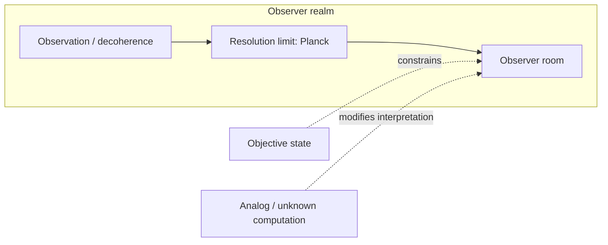

# Planck as the Realm of the Current Observer: Basis, Bias, and Hard Theory

## Abstract

We present an operational framework in which (i) the Planck scale defines the resolution limit—the "realm" or "room"—of any observer in the semiclassical regime; (ii) observation is identified with environmental interaction (decoherence), with no necessary role for consciousness in collapse; (iii) the human observer is modelled as a receiver/emitter of information (frequencies), with consciousness as the translation layer (API) mapping sensed waves to brain states; and (iv) the universe is characterised as an information bound (entropy/state limits in finite regions) as well as a matter-bound. The framework is operational and does not assert fundamental ontology (e.g. whether the universe is analog, digital, or rests on unknown computation). All major claims are accompanied by an explicit proof and refutation scope.

---

## 1. Definitions and conventions

### 1.1 Notation

- **Planck units:** $l_P = \sqrt{\hbar G / c^3}$, $t_P = \sqrt{\hbar G / c^5}$, $E_P = \sqrt{\hbar c^5 / G}$, $\nu_P = 1/t_P \approx 1.85 \times 10^{43}\,\text{Hz}$. Numerical: $l_P \approx 1.62 \times 10^{-35}\,\text{m}$.
- **Entropy bounds:** Bekenstein $S \leq 2\pi R E/(\hbar c)$ (natural units); Bekenstein–Hawking $S_{\text{BH}} = A/(4 G_N) = A/(4 l_P^2)$ in Planck units.
- **Uncertainty and decoherence:** $\Delta E \, \Delta t \gtrsim \hbar$; $\tau_D \sim \hbar / (\Delta E)^2$ (decoherence timescale).

### 1.2 Definitions

- **D1 (Observer):** A **resolution-bounded system** comprising environment and apparatus (and optionally a human) whose effective spatial and temporal resolution is bounded below by the Planck scale in the semiclassical regime. The "Current Observer" is this system, not necessarily a conscious agent.
- **D2 (Room):** The **realm**, **frame**, or **scale** of an observer: the resolution limit and reference system within which physical descriptions are defined. Not necessarily a literal spatial enclosure.
- **D3 (Observation):** **Environmental interaction** that leads to decoherence: entanglement of the system with the environment, suppression of interference, and selection of pointer states. No consciousness is required in the definition.
- **D4 (Consciousness):** The **API** (translation layer) that maps sensed information waves—signals picked up by the human senses (sensors)—to brain states. The human observer is accordingly a **receiver/emitter** of those frequencies.
- **D5 (Information bound):** The **entropy or state limit** for a finite spatial region with finite energy: the maximum number of distinct physical states (or equivalent information content) that can be associated with that region, as given by Bekenstein-type or holographic bounds.

---

## 2. Postulates

- **P1 (Planck resolution limit):** In the semiclassical regime, the resolution of any observer (in the sense of D1) is bounded below by the Planck length $l_P$ and Planck time $t_P$. Finer resolution requires a theory of quantum gravity (e.g. loop quantum gravity, string theory).
- **P2 (Decoherence suffices):** Decoherence (environmental interaction, D3) suffices for effective collapse to a pointer state; no consciousness or privileged observer is required for the appearance of a single outcome.
- **P3 (Human observer as receiver/emitter):** The human observer is a **receiver/emitter** of information (frequencies). Consciousness (D4) is the API that translates these signals to brain states and does not cause quantum collapse.
- **P4 (Finite region, finite information):** Any finite region of space with finite energy has a finite entropy and hence finite information content (Bekenstein-type bound). The primary constraint on physical content is the information bound, with matter and fields as carriers.

---

## 3. Observer vs. decoherence and scope of observation

Under the definitions and postulates above, the following implications hold.

The notion of a "Current Observer" that requires a conscious or localised entity to "observe" is replaced by **observation as environmental interaction** (D3). The environment continuously entangles with the system, suppresses interference, and selects pointer states; no consciousness or privileged observer is needed (P2). Defining the Planck scale as the observer's realm (D2, P1) therefore does not over-emphasise a conscious observer over the **objective state** of the universe: the "room" is a **resolution/frame** constraint, not a claim that reality is observer-created. The framework remains compatible with the possibility that the universe is **analog** or based on a **type of computation we do not yet understand**; in that case the Planck scale is the effective resolution of any finite process in our descriptions, not necessarily the ontological grain.

**Summary:** We take decoherence seriously (observation = environmental interaction); we treat the Planck scale as the observer's realm in the sense of resolution/frame (P1, D2); we reconcile this with no fundamental consciousness-dependence (P2, P3) and with analog or unknown-computation scenarios.

---

## 4. Planck as realm of the current observer

### 4.1 Basis (theoretical and empirical footing)

**Planck scale as resolution limit (P1).** The Planck length $l_P$ and time $t_P$ mark the scale at which spacetime is expected to become "foamy" due to quantum fluctuations. Below this scale, classical notions of length and time break down, and the observer's frame cannot resolve finer detail without quantum gravity. Thus $l_P$ and $t_P$ define the **resolution limit** of any description that stays within semiclassical gravity.

**Observer effects at Planck scale.** In relativistic quantum mechanics, the observer's motion (e.g. accelerated frame) induces perceived time dilation and, in quantum settings, superposition of proper times. The inverse Planck time $\nu_P = 1/t_P \sim 10^{43}\,\text{Hz}$ acts as a universal "tick rate" or conversion factor for the finest temporal resolution in this framework.

**Operational view.** If time is the period between states and energy is treated in a binary (qubit-like) way, the Planck scale sets the **minimal "room"** (D2) for measurement: the coarsest scale at which the observer's description remains well-defined. State transitions may be conceived as occurring on timescales of order $t_P$, governed by energy quanta.

**Equations:**

- $l_P = \sqrt{\hbar G / c^3}$, $t_P = \sqrt{\hbar G / c^5}$, $E_P = \sqrt{\hbar c^5 / G}$, $\nu_P = 1/t_P \approx 1.85 \times 10^{43}\,\text{Hz}$.
- At the limit: $\Delta t \gtrsim t_P$ for temporal resolution; $\Delta E \, \Delta t \gtrsim \hbar$ with $\Delta t \sim t_P$ implies $\Delta E \sim E_P$.

### 4.2 Bias

The framework **emphasises** the observer's frame and resolution (Planck as room), an operational and information-theoretic reading of quantum mechanics, and a possible resolution interpretation at $l_P$/$t_P$. It **leaves open** whether the universe is fundamentally digital or analog and whether our notion of "computation" is adequate at the Planck scale. It **takes a stance** on consciousness: consciousness is the API (D4); the observer is a receiver/emitter (P3), not the cause of collapse.

### 4.3 Derived claims and conjecture

- **Claim 1:** The resolution of any observer (D1) in the semiclassical regime cannot exceed the Planck scale. *From P1 and the definition of observer.*
- **Claim 2:** The inverse Planck time $\nu_P$ is the natural upper bound on "tick rate" for any process described within this resolution limit. *From P1 and the definition of $t_P$.*
- **Conjecture 1:** The Planck scale is the effective resolution limit for any finite process. *Not derived; open if spacetime is analog or rests on unknown computation.*

### 4.4 Proof and refutation scope

- **Derivable from postulates:** Claims 1 and 2 follow from P1 and D1–D2.
- **Empirically testable:** Indirectly, via quantum-gravity or high-energy regimes where Planck-scale effects might become relevant; consistency of semiclassical physics with no sub-Planck resolution.
- **Refutable:** Observation of stable sub-Planck resolution in a controlled experiment would challenge P1.
- **Undecidable:** Whether the limit is ontological or only epistemic (analog vs. discrete substrate).

---

## 5. Objective state, analog, unknown computation

### 5.1 Observer vs. objective state

The "room" (D2) is a **resolution/frame** constraint, not a claim that reality is only observer-created. An objective state can exist; the Planck scale is the **limit of resolution** for any observer in this framework (P1), not the sole cause of reality. The observer's realm is the condition for *describing* the world at that scale, not the condition for the world to *be*.

### 5.2 Decoherence

Observation (D3) does the work of decoherence. The "Current Observer" is the localised system (apparatus plus environment) whose effective resolution is bounded by Planck (D1, P1). Consciousness is not required for decoherence (P2); the "room" is the resolution of that system.

### 5.3 Analog and unknown computation

- **Analog universe:** The Planck scale can still be the **effective** resolution of any finite observer or finite process—the scale at which our descriptions run out—even if the underlying dynamics are continuous. The room is then an epistemic/operational limit.
- **Unknown computation:** If the universe rests on computation we do not yet understand, Planck units may be **emergent** rather than fundamental "pixel size." The room remains the observer's effective scale (D2).

### 5.4 Proof and refutation scope

- **Derivable:** The distinction between resolution limit and ontology follows from P1 and D2.
- **Refutable:** Not directly; this is a conceptual distinction. Empirical evidence that reality has no objective state would conflict with the framework’s intent.
- **Undecidable:** Whether the universe is analog or digital, or what "computation" means at the fundamental level.

---

## 6. Hard Theory: theories, equations, puzzles

**"Hard Theory"** denotes the **hard problem of consciousness** (why and how experience arises from physical process) and the **hard limits of physical theory** (Planck scale, measurement, irreversibility).

### 6.1 Theories

- **Quantum measurement problem:** Unitary evolution vs. collapse; role of observer/environment; pointer states and decoherence. Under P2, decoherence suffices for effective collapse; the observer is resolution-bounded (D1), not necessarily conscious.
- **Planck-scale physics:** Quantum gravity and the meaning of "below" $l_P$/$t_P$—whether there is physics at finer scales or whether the observer's room is the final resolution (Conjecture 1).
- **Hard problem of consciousness:** Under P3 and D4, observation is framed as resolution/frame (environment + apparatus); consciousness is the **API** that translates universal information waves picked up by the senses and maps them to brain states. The user-observer is a **receiver/emitter** of those frequencies, not a privileged source of collapse.

### 6.2 Equations and relations

- Planck units: $l_P$, $t_P$, $E_P$, $\nu_P$ (see §1.1, §4.1).
- Uncertainty at the limit: $\Delta E \, \Delta t \gtrsim \hbar$; $\Delta t \sim t_P$ $\Rightarrow$ $\Delta E \sim E_P$.
- Decoherence timescale: $\tau_D \sim \hbar / (\Delta E)^2$; when $\Delta E \sim E_P$, $\tau_D \sim t_P$, linking decoherence to the Planck room.

### 6.3 Puzzles and framework answers

- **Measurement puzzle:** How does a single outcome appear from unitary evolution? The framework favours a resolution-bounded, environment-inclusive observer (D1, P2) without requiring consciousness.
- **Planck puzzle:** Is there physics below the Planck scale? The framework leaves this open: the room is the *effective* resolution (Conjecture 1); ontology may be analog or unknown-computation.
- **Consciousness puzzle:** Is the Current Observer necessarily conscious? Under D4 and P3, the observer is a receiver/emitter; consciousness is the API that maps sensed waves to brain states. The room is resolution-bounded (environment + apparatus); consciousness does not cause collapse but translates what is received and emitted.

### 6.4 Proof and refutation scope

- **Derivable:** That decoherence can account for effective collapse (P2); that consciousness need not enter the collapse mechanism (P3, D4).
- **Empirically testable:** Predictions of decoherence theory; consistency of pointer states with observation.
- **Refutable:** Evidence that collapse requires consciousness would challenge P2/P3.
- **Undecidable:** Why there is something like an API at all (hard problem of consciousness).

---

## 7. Perception–consciousness–world deception

### 7.1 Theories

- **Veil of perception:** We have access to appearances (the phenomenal world), not necessarily to "things in themselves." The observer's room (D2) is both perceptual/cognitive resolution and physical (Planck): we operate within a resolution limit at every level.
- **Cognitive and perceptual bias:** Evolution and neurobiology fix the scales we can resolve (e.g. mesoscopic). The world may have structure at Planck scale or other scales that we do not perceive as such. "Deception" here means **resolution-limited access**, not literal falsehood.
- **Consciousness and "deception":** Consciousness (D4), as the API mapping sensed information waves to brain states, operates at a coarse-grained, post-decoherence level. The "world we perceive" is a **construction** at that level—resolution-dependent and filtered by what the receiver/emitter can resolve. "World deception" = **resolution-limited access** via the sensory API.

### 7.2 Equations and relations

- Information-theoretic bounds: channel capacity, discrimination limits—how much information can be resolved by a system with finite resources.
- Decoherence selects the "perceived" pointer basis; the perceived world is the world in the basis that survives decoherence.
- If state transitions occur at $t_P$, then $t_P$ is the limit of what could in principle be "perceived" by any process bounded by that resolution.

### 7.3 Derived claim

- **Claim 3:** The conscious observer (human as receiver/emitter) operates at scales much coarser than Planck (mesoscopic, decohered). *From P1, P3, D4, and the neurobiological scale of sensory and neural processes.*

### 7.4 Proof and refutation scope

- **Derivable:** Claim 3 from postulates and scale of biology.
- **Empirically testable:** Psychophysics of discrimination limits; channel-capacity models of perception.
- **Undecidable:** Whether the "world" we perceive is "the same" as the world at Planck scale (scale-dependent description vs. "deception" is a matter of terminology).

---

## 8. Universe as information bound (vs. matter)

Seeing the universe as a **bound of information/data** (D5) rather than primarily as matter shifts the focus to how much can be resolved, stored, and transmitted within finite regions. Matter and fields are the carriers; the **bound** is the primary constraint (P4).

### 8.1 Basis: information as the bound

**Key equations:**

- **Bekenstein bound:** $S \leq 2\pi R E/(\hbar c)$ (natural units). Information scales with **surface area**, not volume.
- **Holographic entropy (Bekenstein–Hawking):** $S_{\text{BH}} = A/(4 G_N) = A/(4 l_P^2)$. The horizon area in Planck units counts orthogonal states; the region is maximally described by data on the boundary.
- **Covariant entropy bound (Bousso, Flanagan–Marolf–Wald):** Entropy through a light-sheet is bounded by the generating surface area in units of $4 G_N$.

### 8.2 Contrast: matter-bound vs. information-bound view

| Aspect | Matter-bound view | Information-bound view |
|--------|-------------------|-------------------------|
| **Primary quantity** | Mass, energy, fields in volume | Entropy, state count, data on boundary or in region |
| **Limit** | Conservation laws; UV cutoff | Bekenstein, holographic, CKN bounds; UV–IR linkage |
| **Gravity** | Fundamental force | Emergent (e.g. entropic; spacetime from entanglement) |
| **Practical probe** | Colliders, telescopes | Entropy budgets, horizon thermodynamics, channel capacities |

The information-bound view (P4) says the **cap** on what can exist in a region is set by information/entropy bounds; matter saturates or stays under that cap.

### 8.3 Recent support (2017–2024)

- **Banks (2020); Fields–Glazebrook–Marcianò (2022):** Holographic principle as consequence of quantum information theory; $\log(\text{dim}\,\mathcal{H})$ equals one-quarter of holographic screen area in Planck units.
- **Jacobson (1995); Svesko (2019); Alonso-Serrano–Liška (2020):** Einstein equations from $\delta Q = T\,dS$ on local horizons; entanglement equilibrium in causal diamonds; gravity and geometry emerge from entropy/entanglement.
- **ER = EPR (Verlinde 2020; Jafferis–Schneider 2021; Engelhardt–Liu 2023; 2024):** Spacetime connectivity tied to entanglement; $S \leq A/(4 G_N)$; Bekenstein–Hawking entropy as entanglement entropy.
- **CKN bound (Blinov–Draper 2021; thermodynamic origin 2022):** $\Lambda_{\text{IR}} \gtrsim \Lambda_{\text{UV}}^2 / M_P$; depletion of QFT degrees of freedom with scale; thermodynamic derivation; link to cosmological constant.
- **Verlinde (2017; 2019–2021):** Gravity as emergent from entanglement/entropy; Casini–Bekenstein bound and entropy gradients recover Newton and Einstein equations.
- **Vopson (2021):** Total information in visible matter $\sim 6 \times 10^{80}$ bits; $\sim 1.5$ bits per elementary particle; formula reproducing Eddington number.
- **Horizon entropy and cosmology (2020–2024):** Entanglement entropy of cosmological perturbations; quantum corrections to horizon entropy; mass–horizon relation with $M = \gamma (c^2/G) L^n$, $n=3$, equivalent to $\Lambda$CDM.

### 8.4 Practical-theoretical probes

- Entropy and horizon budgets (observable universe, cosmic horizon; compare Egan–Lineweaver, Vopson).
- CKN and precision QFT (Lamb shift, $g-2$, radiative neutrino masses).
- Emergent gravity tests (galaxy rotation, cluster dynamics vs. $\Lambda$CDM).
- ER = EPR in quantum simulators (tabletop realisations).
- Channel capacity and discrimination limits (observers as finite-capacity channels).
- Unimodular and entropic cosmology (early universe, horizon problem).

### 8.5 Derived claim

- **Claim 4:** The observable universe has a finite information content. *From P4 and Bekenstein/holographic bounds (e.g. Vopson’s $\sim 6 \times 10^{80}$ bits in matter; horizon entropy $\sim 2.6 \times 10^{122}\,k$).*

### 8.6 Proof and refutation scope

- **Derivable from postulates:** Claim 4 from P4 and standard bounds.
- **Empirically testable:** Entropy budgets; CKN and precision observables; emergent gravity; ER=EPR tabletop proposals.
- **Refutable:** Violation of Bekenstein-type bounds in a controlled setting would challenge P4.
- **Undecidable:** Whether the universe is "really" information or matter (ontology).

---

## 9. Summary diagram

- **Observation (decoherence)** → **Resolution limit (Planck)** → **Observer's room.**
- **Objective state** and **analog / unknown computation** modify the interpretation (fundamental vs. emergent, digital vs. analog) but do not remove the room.

---

## 10. Summary of claims and proof scope

| Claim | Source | Proof scope |
|-------|--------|-------------|
| Resolution of any observer bounded below by Planck scale | P1, D1 | Derived |
| $\nu_P$ as upper bound on tick rate in this framework | P1, $t_P$ | Derived |
| Planck scale is effective resolution limit for any finite process | Conjecture 1 | Undecidable (open if analog/unknown computation) |
| Observable universe has finite information content | P4, Bekenstein/holographic bounds | Derived |
| Conscious observer operates at coarser-than-Planck scale | P1, P3, D4, neurobiological scale | Derived |
| Decoherence suffices for effective collapse; no consciousness required | P2 | Derived; refutable if consciousness shown necessary for collapse |
| Human observer is receiver/emitter; consciousness is API | P3, D4 | Postulate; refutable if collapse requires consciousness |
| Why there is something like an API (hard problem) | — | Undecidable |
| Universe "really" information vs. matter | — | Undecidable (ontology) |

---

## 11. File and format

This document is a single Markdown file. Equations use `$...$` (inline) and `$$...$$` (display) for LaTeX-style math. Structure: Abstract; Definitions and conventions (§1); Postulates (§2); Observer vs. decoherence (§3); Planck as realm (§4); Objective state, analog, unknown computation (§5); Hard Theory (§6); Perception–consciousness–world deception (§7); Universe as information bound (§8); Summary diagram (§9); Summary of claims and proof scope (§10); File and format (§11); Coupling dynamics (§12).

---

## 12. Coupling dynamics: Observer–lattice feedback

### 12.1 Structured Hamiltonian with intentionality coupling

The lattice Hamiltonian is extended by a coupling term that modulates operators via the observer's intentionality field $I(v)$:

$$
\hat{H}_{\text{total}} = \hat{H}_{\text{lattice}} + \sum_v \lambda_v\bigl(I(v)\bigr)\,\hat{O}_v
$$

where $\hat{H}_{\text{lattice}} = \hat{H}_{\text{lattice}}^\dagger$, $\hat{O}_v = \hat{O}_v^\dagger$, and $\lambda_v(I(v)) \in \mathbb{R}$. Under these conditions $\hat{H}_{\text{total}}^\dagger = \hat{H}_{\text{total}}$, so the Hamiltonian is well-defined and generates unitary evolution via the single-step operator $\hat{W}$ introduced in the theoretical foundations.

### 12.2 The status of $I(v)$

$I(v)$ is the **intentionality bias** at lattice site $v$ — the local contribution of the observer's API output (D4) that shifts the projection basis of $\hat{O}_v$. It corresponds operationally to the emitted frequency profile of the observer in emitter mode (ANCHOR.md). The coupling function $\lambda_v$ can be any real-valued map; its specific form determines how strongly the observer's state biases the local lattice dynamics.

A Hamiltonian that depends on an external parameter $I$ is formally unproblematic for *open* dynamics, but the REALMS framework treats the observer–lattice system as closed — no external parameter injects information from outside. If $I(v)$ appears only as a free parameter in $\hat{H}_{\text{total}}$, the generator becomes state-dependent:

$$
\hat{H}_{\text{total}} = \hat{H}\bigl(|\Psi\rangle, I\bigr)
$$

which is not an autonomous operator. This is permissible **only if $I$ itself is part of the dynamical system**.

### 12.3 Extended state space

To close the system, the state space is extended to include the intentionality field as a dynamical variable:

$$
|\Phi(t)\rangle = \bigl(|\Psi(t)\rangle,\; I(t)\bigr)
$$

Evolution is governed by two coupled equations:

$$
\begin{aligned}
\text{(1)}\quad & |\Psi_{t+1}\rangle = \hat{W}(I_t)\,|\Psi_t\rangle \\[4pt]
\text{(2)}\quad & I_{t+1}(v) = f\bigl(\operatorname{Tr}_{\bar{v}}(|\Psi_t\rangle\langle\Psi_t|)\bigr)
\end{aligned}
$$

or, more generally, $I_{t+1} = F(I_t, |\Psi_t\rangle)$ for an update map $F$ that may be site-local or non-local depending on the observer's coherence radius.

Equation (1) is the standard unitary step of the QCA lattice, now conditioned on the current intentionality field. Equation (2) is the **API feedback law**: the observer extracts the reduced density matrix at site $v$ (tracing out the complement $\bar{v}$) and maps it to an updated bias $I_{t+1}(v)$ via $f$. This is the formal expression of D4's emitter mode — consciousness does not cause collapse (P2), but it modulates the operator basis for the next unitary step.

### 12.4 Feedback loop

The coupled system forms a closed loop:

$$
|\Psi_t\rangle \;\longrightarrow\; I_{t+1} = f\bigl(\operatorname{Tr}_{\bar{v}}(|\Psi_t\rangle\langle\Psi_t|)\bigr) \;\longrightarrow\; \hat{W}(I_{t+1}) \;\longrightarrow\; |\Psi_{t+2}\rangle
$$

State influences intentionality, intentionality influences the evolution operator, the operator updates the state. No external input is required; the observer–lattice system is autonomous.

### 12.5 Meta-level nonlinearity

Conditioned on a fixed $I$, the map $|\Psi\rangle \mapsto \hat{W}(I)|\Psi\rangle$ is linear and unitary. However, the extended system

$$
\bigl(|\Psi\rangle, I\bigr) \;\longmapsto\; \bigl(|\Psi'\rangle, I'\bigr)
$$

is **effectively nonlinear** because $I$ couples back into the generator. This nonlinearity is not a violation of quantum mechanics — it arises from the deliberate extension of the state space to include the API control field. It is analogous to adaptive tensor networks, feedback-controlled quantum circuits, and dynamical graph Hamiltonians.

### 12.6 Stationary states and the anchor

A stationary state of the extended system satisfies:

$$
\begin{aligned}
\hat{W}(I)\,|\Psi\rangle &= |\Psi\rangle \\
F(I, |\Psi\rangle) &= I
\end{aligned}
$$

That is, it is a **fixed point of the coupled system**, not merely an eigenstate of $\hat{H}_{\text{lattice}}$. The anchor state $|\Psi_{\text{anchor}}\rangle$ defined in ANCHOR.md is precisely such a fixed point: the collective API emission stabilises $I$ such that $\hat{W}(I)$ reproduces $|\Psi\rangle$, and the reduced density at each site yields the same $I$ via $f$.

When the observer population coordinates its API emission toward a common target (MANIFESTATION.md), the system flows from its current fixed point toward the target fixed point along a trajectory in the extended state space. The flow is deterministic given $F$ and the initial $I_0$.

### 12.7 Connection to D4 and P3

Definition D4 (consciousness as API) and postulate P3 (observer as receiver/emitter) are given operational meaning here. The receiver mode of P3 corresponds to the measurement that produces $\operatorname{Tr}_{\bar{v}}(|\Psi_t\rangle\langle\Psi_t|)$. The emitter mode corresponds to the application of $f$ to produce $I_{t+1}$. The API (D4) is the pair $(\operatorname{Tr}_{\bar{v}}, f)$ — a down-sampling from lattice to observer scale, followed by an up-sampling back to lattice bias. This completes the operational definition that P3 and D4 left open: consciousness is not merely a label for the translation layer, but an explicit feedback map acting on the reduced state of the observer's local lattice patch.
