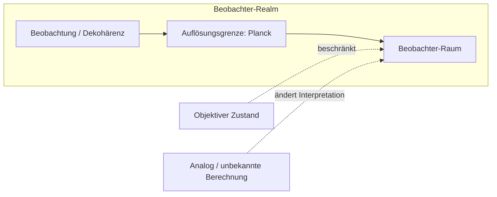

# Planck als Realm des aktuellen Beobachters: Basis, Bias und Hard Theory

## Abstract

Es wird ein operationaler Rahmen vorgestellt, in dem (i) die Planck-Skala die Auflösungsgrenze – den „Realm“ oder „Raum“ – eines jeden Beobachters im semiklassischen Regime definiert; (ii) Beobachtung mit Umgebungswechselwirkung (Dekohärenz) identifiziert wird, ohne dass Bewusstsein für den Kollaps notwendig wäre; (iii) der menschliche Beobachter als Empfänger/Sender von Information (Frequenzen) modelliert wird, mit dem Bewusstsein als Übersetzungsschicht (API), die wahrgenommene Wellen auf Hirnzustände abbildet; und (iv) das Universum sowohl als Informationsgrenze (Entropie-/Zustandsgrenzen in endlichen Regionen) als auch als materiegebunden charakterisiert wird. Der Rahmen ist operational und trifft keine Aussage über fundamentale Ontologie (z. B. ob das Universum analog, digital ist oder auf unbekannter Berechnung beruht). Alle wesentlichen Behauptungen werden von einem expliziten Beweis- und Widerlegungsbereich begleitet.

---

## 1. Definitionen und Konventionen

### 1.1 Notation

- **Planck-Einheiten:** $l_P = \sqrt{\hbar G / c^3}$, $t_P = \sqrt{\hbar G / c^5}$, $E_P = \sqrt{\hbar c^5 / G}$, $\nu_P = 1/t_P \approx 1.85 \times 10^{43}\,\text{Hz}$. Numerisch: $l_P \approx 1.62 \times 10^{-35}\,\text{m}$.
- **Entropiegrenzen:** Bekenstein $S \leq 2\pi R E/(\hbar c)$ (natürliche Einheiten); Bekenstein–Hawking $S_{\text{BH}} = A/(4 G_N) = A/(4 l_P^2)$ in Planck-Einheiten.
- **Unschärfe und Dekohärenz:** $\Delta E \, \Delta t \gtrsim \hbar$; $\tau_D \sim \hbar / (\Delta E)^2$ (Dekohärenzzeitskala).

### 1.2 Definitionen

- **D1 (Beobachter):** Ein **auflösungsbeschränktes System** aus Umgebung und Apparatur (und optional einem Menschen), dessen effektive räumliche und zeitliche Auflösung im semiklassischen Regime nach unten durch die Planck-Skala beschränkt ist. Der „aktuelle Beobachter“ ist dieses System, nicht notwendigerweise ein bewusstes Wesen.
- **D2 (Raum):** Der **Realm**, das **Bezugssystem** oder die **Skala** eines Beobachters: die Auflösungsgrenze und das Referenzsystem, innerhalb dessen physikalische Beschreibungen definiert sind. Nicht notwendigerweise ein räumlicher Behälter im wörtlichen Sinne.
- **D3 (Beobachtung):** **Umgebungswechselwirkung**, die zu Dekohärenz führt: Verschränkung des Systems mit der Umgebung, Unterdrückung von Interferenz und Auswahl von Zeigerzuständen. In der Definition ist kein Bewusstsein erforderlich.
- **D4 (Bewusstsein):** Die **API** (Übersetzungsschicht), die wahrgenommene Informationswellen – von den menschlichen Sinnen (Sensoren) aufgenommene Signale – auf Hirnzustände abbildet. Der menschliche Beobachter ist entsprechend ein **Empfänger/Sender** dieser Frequenzen.
- **D5 (Informationsgrenze):** Die **Entropie- oder Zustandsgrenze** für eine endliche räumliche Region mit endlicher Energie: die maximale Anzahl verschiedener physikalischer Zustände (oder äquivalenter Informationsgehalt), die dieser Region zugeordnet werden können, wie durch Bekenstein-artige oder holographische Grenzen gegeben.

---

## 2. Postulate

- **P1 (Planck-Auflösungsgrenze):** Im semiklassischen Regime ist die Auflösung eines jeden Beobachters (im Sinne von D1) nach unten durch die Planck-Länge $l_P$ und die Planck-Zeit $t_P$ beschränkt. Feinere Auflösung erfordert eine Theorie der Quantengravitation (z. B. Schleifenquantengravitation, Stringtheorie).
- **P2 (Dekohärenz genügt):** Dekohärenz (Umgebungswechselwirkung, D3) genügt für effektiven Kollaps in einen Zeigerzustand; für das Auftreten eines einzelnen Ergebnisses sind weder Bewusstsein noch ein privilegierter Beobachter erforderlich.
- **P3 (Menschlicher Beobachter als Empfänger/Sender):** Der menschliche Beobachter ist ein **Empfänger/Sender** von Information (Frequenzen). Bewusstsein (D4) ist die API, die diese Signale in Hirnzustände übersetzt und verursacht keinen Quantenkollaps.
- **P4 (Endliche Region, endliche Information):** Jede endliche Raumregion mit endlicher Energie hat endliche Entropie und damit endlichen Informationsgehalt (Bekenstein-artige Grenze). Die primäre Beschränkung des physikalischen Inhalts ist die Informationsgrenze, mit Materie und Feldern als Träger.

---

## 3. Beobachter vs. Dekohärenz und Umfang der Beobachtung

Unter den obigen Definitionen und Postulaten gelten die folgenden Implikationen.

Die Vorstellung eines „aktuellen Beobachters“, der ein bewusstes oder lokalisiertes Wesen zum „Beobachten“ benötigt, wird ersetzt durch **Beobachtung als Umgebungswechselwirkung** (D3). Die Umgebung verschränkt sich ständig mit dem System, unterdrückt Interferenz und wählt Zeigerzustände; Bewusstsein oder ein privilegierter Beobachter sind nicht nötig (P2). Die Definition der Planck-Skala als Realm des Beobachters (D2, P1) überbetont daher nicht einen bewussten Beobachter gegenüber dem **objektiven Zustand** des Universums: Der „Raum“ ist eine **Auflösungs-/Bezugssystem-**Beschränkung, keine Behauptung, dass die Realität vom Beobachter geschaffen wird. Der Rahmen bleibt vereinbar mit der Möglichkeit, dass das Universum **analog** ist oder auf einer **Art von Berechnung beruht, die wir noch nicht verstehen**; in diesem Fall ist die Planck-Skala die effektive Auflösung jedes endlichen Prozesses in unseren Beschreibungen, nicht notwendigerweise das ontologische Korn.

**Zusammenfassung:** Wir nehmen Dekohärenz ernst (Beobachtung = Umgebungswechselwirkung); wir behandeln die Planck-Skala als Realm des Beobachters im Sinne von Auflösung/Bezugssystem (P1, D2); wir verbinden dies mit fehlender fundamentaler Bewusstseinsabhängigkeit (P2, P3) und mit analogen oder unbekannte-Berechnung-Szenarien.

---

## 4. Planck als Realm des aktuellen Beobachters

### 4.1 Basis (theoretische und empirische Grundlage)

**Planck-Skala als Auflösungsgrenze (P1).** Die Planck-Länge $l_P$ und -Zeit $t_P$ markieren die Skala, auf der die Raumzeit aufgrund quantenmechanischer Fluktuationen „schaumig“ werden soll. Unterhalb dieser Skala brechen klassische Begriffe von Länge und Zeit zusammen, und das Bezugssystem des Beobachters kann ohne Quantengravitation feinere Details nicht auflösen. Somit definieren $l_P$ und $t_P$ die **Auflösungsgrenze** jeder Beschreibung, die innerhalb semiklassischer Gravitation bleibt.

**Beobachtereffekte auf der Planck-Skala.** In der relativistischen Quantenmechanik induziert die Bewegung des Beobachters (z. B. beschleunigtes Bezugssystem) wahrgenommene Zeitdilatation und in Quantensituationen Überlagerung von Eigenzeiten. Die inverse Planck-Zeit $\nu_P = 1/t_P \sim 10^{43}\,\text{Hz}$ wirkt als universelle „Taktrate“ oder Umrechnungsfaktor für die feinste zeitliche Auflösung in diesem Rahmen.

**Operationale Sicht.** Wenn Zeit die Periode zwischen Zuständen ist und Energie binär (qubit-artig) behandelt wird, setzt die Planck-Skala den **minimalen „Raum“** (D2) für Messung: die gröbste Skala, auf der die Beschreibung des Beobachters wohldefiniert bleibt. Zustandsübergänge können auf Zeitskalen der Ordnung $t_P$ stattfinden, gesteuert durch Energiequanten.

**Gleichungen:**

- $l_P = \sqrt{\hbar G / c^3}$, $t_P = \sqrt{\hbar G / c^5}$, $E_P = \sqrt{\hbar c^5 / G}$, $\nu_P = 1/t_P \approx 1.85 \times 10^{43}\,\text{Hz}$.
- An der Grenze: $\Delta t \gtrsim t_P$ für zeitliche Auflösung; $\Delta E \, \Delta t \gtrsim \hbar$ mit $\Delta t \sim t_P$ impliziert $\Delta E \sim E_P$.

### 4.2 Bias

Der Rahmen **betont** das Bezugssystem und die Auflösung des Beobachters (Planck als Raum), eine operationale und informationstheoretische Lesart der Quantenmechanik und eine mögliche Auflösungsinterpretation bei $l_P$/$t_P$. Er **lässt offen**, ob das Universum fundamental digital oder analog ist und ob unser Begriff von „Berechnung“ auf der Planck-Skala angemessen ist. Er **bezieht Stellung** zum Bewusstsein: Bewusstsein ist die API (D4); der Beobachter ist Empfänger/Sender (P3), nicht die Ursache des Kollapses.

### 4.3 Abgeleitete Behauptungen und Vermutung

- **Behauptung 1:** Die Auflösung eines jeden Beobachters (D1) im semiklassischen Regime kann die Planck-Skala nicht überschreiten. *Aus P1 und der Definition des Beobachters.*
- **Behauptung 2:** Die inverse Planck-Zeit $\nu_P$ ist die natürliche obere Schranke für die „Taktrate“ eines jeden innerhalb dieser Auflösungsgrenze beschriebenen Prozesses. *Aus P1 und der Definition von $t_P$.*
- **Vermutung 1:** Die Planck-Skala ist die effektive Auflösungsgrenze für jeden endlichen Prozess. *Nicht abgeleitet; offen, ob die Raumzeit analog ist oder auf unbekannter Berechnung beruht.*

### 4.4 Beweis- und Widerlegungsbereich

- **Aus Postulaten ableitbar:** Behauptungen 1 und 2 folgen aus P1 und D1–D2.
- **Empirisch prüfbar:** Indirekt über Quantengravitations- oder Hochenergie-Regime, in denen Planck-Skala-Effekte relevant werden könnten; Konsistenz der semiklassischen Physik ohne sub-Planck-Auflösung.
- **Widerlegbar:** Beobachtung stabiler sub-Planck-Auflösung in einem kontrollierten Experiment würde P1 in Frage stellen.
- **Unentscheidbar:** Ob die Grenze ontologisch oder nur epistemisch ist (analog vs. diskretes Substrat).

---

## 5. Objektiver Zustand, analog, unbekannte Berechnung

### 5.1 Beobachter vs. objektiver Zustand

Der „Raum“ (D2) ist eine **Auflösungs-/Bezugssystem-**Beschränkung, keine Behauptung, dass die Realität nur vom Beobachter geschaffen wird. Ein objektiver Zustand kann existieren; die Planck-Skala ist die **Auflösungsgrenze** für jeden Beobachter in diesem Rahmen (P1), nicht die alleinige Ursache der Realität. Der Realm des Beobachters ist die Bedingung dafür, die Welt in dieser Skala zu *beschreiben*, nicht die Bedingung dafür, dass die Welt *ist*.

### 5.2 Dekohärenz

Beobachtung (D3) leistet die Dekohärenz. Der „aktuelle Beobachter“ ist das lokalisierte System (Apparatur plus Umgebung), dessen effektive Auflösung durch Planck beschränkt ist (D1, P1). Für Dekohärenz ist kein Bewusstsein erforderlich (P2); der „Raum“ ist die Auflösung dieses Systems.

### 5.3 Analog und unbekannte Berechnung

- **Analoges Universum:** Die Planck-Skala kann weiterhin die **effektive** Auflösung eines jeden endlichen Beobachters oder endlichen Prozesses sein – die Skala, an der unsere Beschreibungen enden – auch wenn die zugrundeliegende Dynamik kontinuierlich ist. Der Raum ist dann eine epistemische/operative Grenze.
- **Unbekannte Berechnung:** Wenn das Universum auf einer Berechnung beruht, die wir noch nicht verstehen, können Planck-Einheiten **emergent** statt fundamentaler „Pixelgröße“ sein. Der Raum bleibt die effektive Skala des Beobachters (D2).

### 5.4 Beweis- und Widerlegungsbereich

- **Ableitbar:** Die Unterscheidung zwischen Auflösungsgrenze und Ontologie folgt aus P1 und D2.
- **Widerlegbar:** Nicht direkt; es handelt sich um eine begriffliche Unterscheidung. Empirische Evidenz, dass die Realität keinen objektiven Zustand hat, stünde im Widerspruch zur Intention des Rahmens.
- **Unentscheidbar:** Ob das Universum analog oder digital ist oder was „Berechnung“ auf fundamentaler Ebene bedeutet.

---

## 6. Hard Theory: Theorien, Gleichungen, Rätsel

**„Hard Theory“** bezeichnet das **schwere Problem des Bewusstseins** (warum und wie Erfahrung aus physikalischem Prozess entsteht) und die **harten Grenzen der physikalischen Theorie** (Planck-Skala, Messung, Irreversibilität).

### 6.1 Theorien

- **Quantenmessproblem:** Unitäre Evolution vs. Kollaps; Rolle von Beobachter/Umgebung; Zeigerzustände und Dekohärenz. Unter P2 genügt Dekohärenz für effektiven Kollaps; der Beobachter ist auflösungsbeschränkt (D1), nicht notwendigerweise bewusst.
- **Planck-Skala-Physik:** Quantengravitation und die Bedeutung von „unterhalb“ $l_P$/$t_P$ – ob es Physik auf feineren Skalen gibt oder ob der Raum des Beobachters die letzte Auflösung ist (Vermutung 1).
- **Schweres Problem des Bewusstseins:** Unter P3 und D4 wird Beobachtung als Auflösung/Bezugssystem (Umgebung + Apparatur) gefasst; Bewusstsein ist die **API**, die die von den Sinnen aufgenommenen universellen Informationswellen übersetzt und auf Hirnzustände abbildet. Der Nutzer-Beobachter ist **Empfänger/Sender** dieser Frequenzen, keine privilegierte Quelle des Kollapses.

### 6.2 Gleichungen und Relationen

- Planck-Einheiten: $l_P$, $t_P$, $E_P$, $\nu_P$ (siehe §1.1, §4.1).
- Unschärfe an der Grenze: $\Delta E \, \Delta t \gtrsim \hbar$; $\Delta t \sim t_P$ $\Rightarrow$ $\Delta E \sim E_P$.
- Dekohärenzzeitskala: $\tau_D \sim \hbar / (\Delta E)^2$; wenn $\Delta E \sim E_P$, dann $\tau_D \sim t_P$, was Dekohärenz mit dem Planck-Raum verknüpft.

### 6.3 Rätsel und Rahmen-Antworten

- **Messrätsel:** Wie entsteht ein einzelnes Ergebnis aus unitärer Evolution? Der Rahmen bevorzugt einen auflösungsbeschränkten, umgebungseinschließenden Beobachter (D1, P2) ohne Erfordernis von Bewusstsein.
- **Planck-Rätsel:** Gibt es Physik unterhalb der Planck-Skala? Der Rahmen lässt dies offen: Der Raum ist die *effektive* Auflösung (Vermutung 1); die Ontologie kann analog oder unbekannte-Berechnung sein.
- **Bewusstseinsrätsel:** Ist der aktuelle Beobachter notwendigerweise bewusst? Unter D4 und P3 ist der Beobachter Empfänger/Sender; Bewusstsein ist die API, die wahrgenommene Wellen auf Hirnzustände abbildet. Der Raum ist auflösungsbeschränkt (Umgebung + Apparatur); Bewusstsein verursacht keinen Kollaps, sondern übersetzt das Empfangene und Gesendete.

### 6.4 Beweis- und Widerlegungsbereich

- **Ableitbar:** Dass Dekohärenz effektiven Kollaps erklären kann (P2); dass Bewusstsein nicht in den Kollapsmechanismus eingehen muss (P3, D4).
- **Empirisch prüfbar:** Vorhersagen der Dekohärenztheorie; Konsistenz der Zeigerzustände mit Beobachtung.
- **Widerlegbar:** Evidenz, dass Kollaps Bewusstsein erfordert, würde P2/P3 in Frage stellen.
- **Unentscheidbar:** Warum es überhaupt so etwas wie eine API gibt (schweres Problem des Bewusstseins).

---

## 7. Wahrnehmung–Bewusstsein–Welt-Täuschung

### 7.1 Theorien

- **Schleier der Wahrnehmung:** Wir haben Zugang zu Erscheinungen (der phänomenalen Welt), nicht notwendigerweise zu „Dingen an sich“. Der Raum des Beobachters (D2) ist sowohl perzeptuelle/kognitive Auflösung als auch physikalisch (Planck): Wir operieren auf jeder Ebene innerhalb einer Auflösungsgrenze.
- **Kognitive und perzeptuelle Verzerrung:** Evolution und Neurobiologie legen die Skalen fest, die wir auflösen können (z. B. mesoskopisch). Die Welt kann Struktur auf Planck-Skala oder anderen Skalen haben, die wir nicht als solche wahrnehmen. „Täuschung“ bedeutet hier **auflösungsbeschränkten Zugang**, nicht wörtliche Falschheit.
- **Bewusstsein und „Täuschung“:** Bewusstsein (D4) als die API, die wahrgenommene Informationswellen auf Hirnzustände abbildet, operiert auf einer grobkörnigen, post-Dekohärenz-Ebene. Die „von uns wahrgenommene Welt“ ist eine **Konstruktion** auf dieser Ebene – auflösungsabhängig und gefiltert durch das, was der Empfänger/Sender auflösen kann. „Welt-Täuschung“ = **auflösungsbeschränkter Zugang** über die sensorische API.

### 7.2 Gleichungen und Relationen

- Informationstheoretische Grenzen: Kanalkapazität, Diskriminationsgrenzen – wie viel Information von einem System mit endlichen Ressourcen aufgelöst werden kann.
- Dekohärenz wählt die „wahrgenommene“ Zeigerbasis; die wahrgenommene Welt ist die Welt in der Basis, die die Dekohärenz überdauert.
- Wenn Zustandsübergänge bei $t_P$ auftreten, dann ist $t_P$ die Grenze dessen, was prinzipiell von einem durch diese Auflösung beschränkten Prozess „wahrgenommen“ werden könnte.

### 7.3 Abgeleitete Behauptung

- **Behauptung 3:** Der bewusste Beobachter (Mensch als Empfänger/Sender) operiert auf viel gröberen Skalen als Planck (mesoskopisch, dekohärent). *Aus P1, P3, D4 und der neurobiologischen Skala sensorischer und neuronaler Prozesse.*

### 7.4 Beweis- und Widerlegungsbereich

- **Ableitbar:** Behauptung 3 aus Postulaten und biologischer Skala.
- **Empirisch prüfbar:** Psychophysik der Diskriminationsgrenzen; Kanalkapazitätsmodelle der Wahrnehmung.
- **Unentscheidbar:** Ob die „Welt“, die wir wahrnehmen, „dieselbe“ ist wie die Welt auf Planck-Skala (skalenabhängige Beschreibung vs. „Täuschung“ ist eine Frage der Terminologie).

---

## 8. Universum als Informationsgrenze (vs. Materie)

Das Universum als **Grenze von Information/Daten** (D5) statt primär als Materie zu sehen verlagert den Fokus darauf, wie viel innerhalb endlicher Regionen aufgelöst, gespeichert und übertragen werden kann. Materie und Felder sind die Träger; die **Grenze** ist die primäre Beschränkung (P4).

### 8.1 Basis: Information als Grenze

**Zentrale Gleichungen:**

- **Bekenstein-Grenze:** $S \leq 2\pi R E/(\hbar c)$ (natürliche Einheiten). Information skaliert mit **Oberfläche**, nicht mit Volumen.
- **Holographische Entropie (Bekenstein–Hawking):** $S_{\text{BH}} = A/(4 G_N) = A/(4 l_P^2)$. Die Horizontfläche in Planck-Einheiten zählt orthogonale Zustände; die Region wird maximal durch Daten auf dem Rand beschrieben.
- **Kovariante Entropiegrenze (Bousso, Flanagan–Marolf–Wald):** Entropie durch ein Lichtblatt ist durch die erzeugende Oberfläche in Einheiten von $4 G_N$ beschränkt.

### 8.2 Kontrast: materiegebundene vs. informationsgebundene Sicht

| Aspekt | Materiegebundene Sicht | Informationsgebundene Sicht |
|--------|------------------------|----------------------------|
| **Primäre Größe** | Masse, Energie, Felder im Volumen | Entropie, Zustandsanzahl, Daten auf Rand oder in Region |
| **Grenze** | Erhaltungssätze; UV-Cutoff | Bekenstein-, holographische, CKN-Grenzen; UV–IR-Verknüpfung |
| **Gravitation** | Fundamentale Kraft | Emergent (z. B. entropisch; Raumzeit aus Verschränkung) |
| **Praktische Sonde** | Kollider, Teleskope | Entropie-Budgets, Horizont-Thermodynamik, Kanalkapazitäten |

Die informationsgebundene Sicht (P4) besagt, dass die **Obergrenze** dessen, was in einer Region existieren kann, durch Informations-/Entropiegrenzen gesetzt ist; Materie sättigt oder bleibt unter dieser Grenze.

### 8.3 Jüngere Stützung (2017–2024)

- **Banks (2020); Fields–Glazebrook–Marcianò (2022):** Holographisches Prinzip als Konsequenz der Quanteninformationstheorie; $\log(\text{dim}\,\mathcal{H})$ entspricht einem Viertel der holographischen Schirmfläche in Planck-Einheiten.
- **Jacobson (1995); Svesko (2019); Alonso-Serrano–Liška (2020):** Einsteingleichungen aus $\delta Q = T\,dS$ auf lokalen Horizonten; Verschränkungsgleichgewicht in kausalen Diamanten; Gravitation und Geometrie entstehen aus Entropie/Verschränkung.
- **ER = EPR (Verlinde 2020; Jafferis–Schneider 2021; Engelhardt–Liu 2023; 2024):** Raumzeit-Konnektivität an Verschränkung geknüpft; $S \leq A/(4 G_N)$; Bekenstein–Hawking-Entropie als Verschränkungsentropie.
- **CKN-Grenze (Blinov–Draper 2021; thermodynamischer Ursprung 2022):** $\Lambda_{\text{IR}} \gtrsim \Lambda_{\text{UV}}^2 / M_P$; Abnahme der QFT-Freiheitsgrade mit der Skala; thermodynamische Herleitung; Bezug zur kosmologischen Konstante.
- **Verlinde (2017; 2019–2021):** Gravitation als emergent aus Verschränkung/Entropie; Casini–Bekenstein-Grenze und Entropiegradienten reproduzieren Newton- und Einsteingleichungen.
- **Vopson (2021):** Gesamtinformation in sichtbarer Materie $\sim 6 \times 10^{80}$ Bits; $\sim 1.5$ Bits pro Elementarteilchen; Formel, die die Eddington-Zahl reproduziert.
- **Horizontentropie und Kosmologie (2020–2024):** Verschränkungsentropie kosmologischer Störungen; Quantenkorrekturen zur Horizontentropie; Masse–Horizont-Relation mit $M = \gamma (c^2/G) L^n$, $n=3$, äquivalent zu $\Lambda$CDM.

### 8.4 Praktisch-theoretische Sonden

- Entropie- und Horizont-Budgets (beobachtbares Universum, kosmischer Horizont; Vergleich Egan–Lineweaver, Vopson).
- CKN und Präzisions-QFT (Lamb-Shift, $g-2$, radiative Neutrinomassen).
- Tests emergenter Gravitation (Galaxienrotation, Clusterdynamik vs. $\Lambda$CDM).
- ER = EPR in Quantensimulatoren (Tisch-Realisationen).
- Kanalkapazität und Diskriminationsgrenzen (Beobachter als Kanäle endlicher Kapazität).
- Unimodulare und entropische Kosmologie (frühes Universum, Horizontproblem).

### 8.5 Abgeleitete Behauptung

- **Behauptung 4:** Das beobachtbare Universum hat endlichen Informationsgehalt. *Aus P4 und Bekenstein-/holographischen Grenzen (z. B. Vopsons $\sim 6 \times 10^{80}$ Bits in Materie; Horizontentropie $\sim 2.6 \times 10^{122}\,k$).*

### 8.6 Beweis- und Widerlegungsbereich

- **Aus Postulaten ableitbar:** Behauptung 4 aus P4 und Standardgrenzen.
- **Empirisch prüfbar:** Entropie-Budgets; CKN und Präzisionsobservablen; emergente Gravitation; ER=EPR-Tisch-Vorschläge.
- **Widerlegbar:** Verletzung von Bekenstein-artigen Grenzen in kontrollierter Umgebung würde P4 in Frage stellen.
- **Unentscheidbar:** Ob das Universum „wirklich“ Information oder Materie ist (Ontologie).

---

## 9. Zusammenfassungsdiagramm

- **Beobachtung (Dekohärenz)** → **Auflösungsgrenze (Planck)** → **Raum des Beobachters.**
- **Objektiver Zustand** und **analog / unbekannte Berechnung** modifizieren die Interpretation (fundamental vs. emergent, digital vs. analog), beseitigen aber nicht den Raum.

---

## 10. Zusammenfassung der Behauptungen und des Beweisbereichs

| Behauptung | Quelle | Beweisbereich |
|------------|--------|---------------|
| Auflösung eines jeden Beobachters nach unten durch Planck-Skala beschränkt | P1, D1 | Abgeleitet |
| $\nu_P$ als obere Schranke für Taktrate in diesem Rahmen | P1, $t_P$ | Abgeleitet |
| Planck-Skala ist effektive Auflösungsgrenze für jeden endlichen Prozess | Vermutung 1 | Unentscheidbar (offen bei analog/unbekannte Berechnung) |
| Beobachtbares Universum hat endlichen Informationsgehalt | P4, Bekenstein-/holographische Grenzen | Abgeleitet |
| Bewusster Beobachter operiert auf gröberer als Planck-Skala | P1, P3, D4, neurobiologische Skala | Abgeleitet |
| Dekohärenz genügt für effektiven Kollaps; Bewusstsein nicht erforderlich | P2 | Abgeleitet; widerlegbar, wenn Bewusstsein für Kollaps notwendig gezeigt wird |
| Menschlicher Beobachter ist Empfänger/Sender; Bewusstsein ist API | P3, D4 | Postulat; widerlegbar, wenn Kollaps Bewusstsein erfordert |
| Warum es überhaupt so etwas wie eine API gibt (schweres Problem) | — | Unentscheidbar |
| Universum „wirklich“ Information vs. Materie | — | Unentscheidbar (Ontologie) |

---

## 11. Datei und Format

Dieses Dokument ist eine einzelne Markdown-Datei. Gleichungen verwenden `$...$` (inline) und `$$...$$` (display) für LaTeX-artige Mathematik. Struktur: Abstract; Definitionen und Konventionen (§1); Postulate (§2); Beobachter vs. Dekohärenz (§3); Planck als Realm (§4); Objektiver Zustand, analog, unbekannte Berechnung (§5); Hard Theory (§6); Wahrnehmung–Bewusstsein–Welt-Täuschung (§7); Universum als Informationsgrenze (§8); Zusammenfassungsdiagramm (§9); Zusammenfassung der Behauptungen und des Beweisbereichs (§10); Datei und Format (§11).
