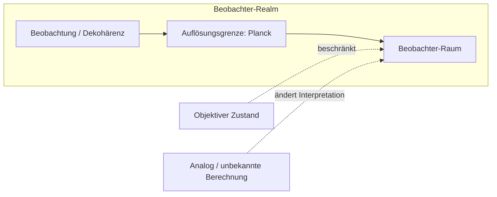

## Vorwort

Dieses Manuskript stellt einen operationalen Rahmen vor, der auf der Planck-Skala, dem Beobachter als Empfänger/Sender von Information, dem Bewusstsein als Übersetzungsschicht (API) und Informationsgrenzen aufbaut, mit Erweiterungen zu API-Manipulation und perzeptueller Materialisierung.

**Zweck.** Der Text entwickelt (i) eine wissenschaftliche Struktur aus Definitionen, Postulaten und Beweis-/Widerlegungsbereich für „Planck als Realm des aktuellen Beobachters“; (ii) eine hypothetische Verknüpfung zwischen der Bewusstseins-API und wellenlängenabhängiger Wahrnehmung, einschließlich Hirnwellenzuständen; (iii) eine Materialisierungsthese – dass Photonenemission in der richtigen Art oder Frequenz von der API als Materie interpretiert werden kann – plus Photonenspeicherung sowie Abgrenzung zu quantenmechanischer Interferenz, Slicing und Pufferüberlauf; und (iv) eine informations-theoretische Grundlage der Raumzeit: Tensor-Netzwerke, Verschränkung–Geometrie, Informations-Lagrangian, Emergenz der Einsteinschen Gravitation und des Standardmodells sowie Weg zu einer finalen Theorie der Quantengravitation.

**Struktur.** Das Manuskript gliedert sich in vier Teile:

- **Teil I — Planck als Realm des aktuellen Beobachters** (REALMS): Definitionen und Konventionen (D1–D5), Postulate (P1–P4), Beobachter vs. Dekohärenz, Planck als Realm, objektiver Zustand und analoge/unbekannte Berechnung, Hard Theory, Wahrnehmung–Bewusstsein–Welt-Täuschung, Universum als Informationsgrenze, Zusammenfassungsdiagramm und Zusammenfassung der Behauptungen und des Beweisbereichs.
- **Teil II — API-Manipulation und Wellenlängen–Wahrnehmungs-Hypothese:** API als manipulierbare Schnittstelle (Virus-Brücke), Störung durch spezifische Wellenlängen, Hirnwellenzustände (Delta, Theta, Alpha, Beta, Gamma) und Synthese.
- **Teil III — Materialisierungsthese:** Materialisierungsthese (Licht/Photonen als Materie beobachtet), Bezug zu REALMS und API-Manipulation, Arten und Frequenzen, Photonenspeicherung, Abgrenzung zu quantenmechanischer Interferenz und Slicing, Abgrenzung zu Pufferüberlauf.
- **Teil IV — Informations-theoretische Grundlage der Raumzeit:** Notation und Postulate, Tensor-Netzwerk-Modell, Quantenfehlerkorrektur, emergente Geometrie und Raumzeitdynamik, Ableitung der Einsteingleichungen aus Verschränkung, Informations-Lagrangian, Quantengeometrie-Fluktuationen, Emergenz von Eich- und Materiefeldern, Quantengravitation und Überlagerung von Geometrien, kosmologische Implikationen und Forschungsprogramm hin zu einer finalen Theorie.

Eine detaillierte Inhaltsangabe folgt auf der nächsten Seite (wird im PDF automatisch erzeugt).

**Lesehinweis.** Das Dokument ist in wissenschaftlichem Stil verfasst. Wo etwas als hypothetisch oder spekulativ gekennzeichnet ist, soll es entsprechend gelesen werden. Teil I verwendet nummerierte Definitionen (D1–D5), Postulate (P1–P4) und explizite Unterabschnitte „Beweis- und Widerlegungsbereich“. Teile II, III und IV bauen auf Teil I auf und verweisen darauf (z. B. D4, P3, D5, P4, Empfänger/Sender).

**Konventionen.** Gleichungen verwenden die übliche Inline-Notation ($...$). Querverweise auf REALMS (z. B. D4, P3) und zwischen den Teilen werden wo relevant verwendet. Das Stichwortverzeichnis am Ende verweist auf Abschnitte, in denen wichtige Begriffe eingeführt oder erörtert werden.

# Teil I — Planck als Realm des aktuellen Beobachters

## Abstract

Es wird ein operationaler Rahmen vorgestellt, in dem (i) die Planck-Skala die Auflösungsgrenze – den „Realm“ oder „Raum“ – eines jeden Beobachters im semiklassischen Regime definiert; (ii) Beobachtung mit Umgebungswechselwirkung (Dekohärenz) identifiziert wird, ohne dass Bewusstsein für den Kollaps notwendig wäre; (iii) der menschliche Beobachter als Empfänger/Sender von Information (Frequenzen) modelliert wird, mit dem Bewusstsein als Übersetzungsschicht (API), die wahrgenommene Wellen auf Hirnzustände abbildet; und (iv) das Universum sowohl als Informationsgrenze (Entropie-/Zustandsgrenzen in endlichen Regionen) als auch als materiegebunden charakterisiert wird. Der Rahmen ist operational und trifft keine Aussage über fundamentale Ontologie (z. B. ob das Universum analog, digital ist oder auf unbekannter Berechnung beruht). Alle wesentlichen Behauptungen werden von einem expliziten Beweis- und Widerlegungsbereich begleitet.

---

## 1. Definitionen und Konventionen

### 1.1 Notation

- **Planck-Einheiten:** $l_P = \sqrt{\hbar G / c^3}$, $t_P = \sqrt{\hbar G / c^5}$, $E_P = \sqrt{\hbar c^5 / G}$, $\nu_P = 1/t_P \approx 1.85 \times 10^{43}\,\text{Hz}$. Numerisch: $l_P \approx 1.62 \times 10^{-35}\,\text{m}$.
- **Entropiegrenzen:** Bekenstein $S \leq 2\pi R E/(\hbar c)$ (natürliche Einheiten); Bekenstein–Hawking $S_{\text{BH}} = A/(4 G_N) = A/(4 l_P^2)$ in Planck-Einheiten.
- **Unschärfe und Dekohärenz:** $\Delta E \, \Delta t \gtrsim \hbar$; $\tau_D \sim \hbar / (\Delta E)^2$ (Dekohärenzzeitskala).

### 1.2 Definitionen

- **D1 (Beobachter):** Ein **auflösungsbeschränktes System** aus Umgebung und Apparatur (und optional einem Menschen), dessen effektive räumliche und zeitliche Auflösung im semiklassischen Regime nach unten durch die Planck-Skala beschränkt ist. Der „aktuelle Beobachter“ ist dieses System, nicht notwendigerweise ein bewusstes Wesen.
- **D2 (Raum):** Der **Realm**, das **Bezugssystem** oder die **Skala** eines Beobachters: die Auflösungsgrenze und das Referenzsystem, innerhalb dessen physikalische Beschreibungen definiert sind. Nicht notwendigerweise ein räumlicher Behälter im wörtlichen Sinne.
- **D3 (Beobachtung):** **Umgebungswechselwirkung**, die zu Dekohärenz führt: Verschränkung des Systems mit der Umgebung, Unterdrückung von Interferenz und Auswahl von Zeigerzuständen. In der Definition ist kein Bewusstsein erforderlich.
- **D4 (Bewusstsein):** Die **API** (Übersetzungsschicht), die wahrgenommene Informationswellen – von den menschlichen Sinnen (Sensoren) aufgenommene Signale – auf Hirnzustände abbildet. Der menschliche Beobachter ist entsprechend ein **Empfänger/Sender** dieser Frequenzen.
- **D5 (Informationsgrenze):** Die **Entropie- oder Zustandsgrenze** für eine endliche räumliche Region mit endlicher Energie: die maximale Anzahl verschiedener physikalischer Zustände (oder äquivalenter Informationsgehalt), die dieser Region zugeordnet werden können, wie durch Bekenstein-artige oder holographische Grenzen gegeben.

---

## 2. Postulate

- **P1 (Planck-Auflösungsgrenze):** Im semiklassischen Regime ist die Auflösung eines jeden Beobachters (im Sinne von D1) nach unten durch die Planck-Länge $l_P$ und die Planck-Zeit $t_P$ beschränkt. Feinere Auflösung erfordert eine Theorie der Quantengravitation (z. B. Schleifenquantengravitation, Stringtheorie).
- **P2 (Dekohärenz genügt):** Dekohärenz (Umgebungswechselwirkung, D3) genügt für effektiven Kollaps in einen Zeigerzustand; für das Auftreten eines einzelnen Ergebnisses sind weder Bewusstsein noch ein privilegierter Beobachter erforderlich.
- **P3 (Menschlicher Beobachter als Empfänger/Sender):** Der menschliche Beobachter ist ein **Empfänger/Sender** von Information (Frequenzen). Bewusstsein (D4) ist die API, die diese Signale in Hirnzustände übersetzt und verursacht keinen Quantenkollaps.
- **P4 (Endliche Region, endliche Information):** Jede endliche Raumregion mit endlicher Energie hat endliche Entropie und damit endlichen Informationsgehalt (Bekenstein-artige Grenze). Die primäre Beschränkung des physikalischen Inhalts ist die Informationsgrenze, mit Materie und Feldern als Träger.

---

## 3. Beobachter vs. Dekohärenz und Umfang der Beobachtung

Unter den obigen Definitionen und Postulaten gelten die folgenden Implikationen.

Die Vorstellung eines „aktuellen Beobachters“, der ein bewusstes oder lokalisiertes Wesen zum „Beobachten“ benötigt, wird ersetzt durch **Beobachtung als Umgebungswechselwirkung** (D3). Die Umgebung verschränkt sich ständig mit dem System, unterdrückt Interferenz und wählt Zeigerzustände; Bewusstsein oder ein privilegierter Beobachter sind nicht nötig (P2). Die Definition der Planck-Skala als Realm des Beobachters (D2, P1) überbetont daher nicht einen bewussten Beobachter gegenüber dem **objektiven Zustand** des Universums: Der „Raum“ ist eine **Auflösungs-/Bezugssystem-**Beschränkung, keine Behauptung, dass die Realität vom Beobachter geschaffen wird. Der Rahmen bleibt vereinbar mit der Möglichkeit, dass das Universum **analog** ist oder auf einer **Art von Berechnung beruht, die wir noch nicht verstehen**; in diesem Fall ist die Planck-Skala die effektive Auflösung jedes endlichen Prozesses in unseren Beschreibungen, nicht notwendigerweise das ontologische Korn.

**Zusammenfassung:** Wir nehmen Dekohärenz ernst (Beobachtung = Umgebungswechselwirkung); wir behandeln die Planck-Skala als Realm des Beobachters im Sinne von Auflösung/Bezugssystem (P1, D2); wir verbinden dies mit fehlender fundamentaler Bewusstseinsabhängigkeit (P2, P3) und mit analogen oder unbekannte-Berechnung-Szenarien.

---

## 4. Planck als Realm des aktuellen Beobachters

### 4.1 Basis (theoretische und empirische Grundlage)

**Planck-Skala als Auflösungsgrenze (P1).** Die Planck-Länge $l_P$ und -Zeit $t_P$ markieren die Skala, auf der die Raumzeit aufgrund quantenmechanischer Fluktuationen „schaumig“ werden soll. Unterhalb dieser Skala brechen klassische Begriffe von Länge und Zeit zusammen, und das Bezugssystem des Beobachters kann ohne Quantengravitation feinere Details nicht auflösen. Somit definieren $l_P$ und $t_P$ die **Auflösungsgrenze** jeder Beschreibung, die innerhalb semiklassischer Gravitation bleibt.

**Beobachtereffekte auf der Planck-Skala.** In der relativistischen Quantenmechanik induziert die Bewegung des Beobachters (z. B. beschleunigtes Bezugssystem) wahrgenommene Zeitdilatation und in Quantensituationen Überlagerung von Eigenzeiten. Die inverse Planck-Zeit $\nu_P = 1/t_P \sim 10^{43}\,\text{Hz}$ wirkt als universelle „Taktrate“ oder Umrechnungsfaktor für die feinste zeitliche Auflösung in diesem Rahmen.

**Operationale Sicht.** Wenn Zeit die Periode zwischen Zuständen ist und Energie binär (qubit-artig) behandelt wird, setzt die Planck-Skala den **minimalen „Raum“** (D2) für Messung: die gröbste Skala, auf der die Beschreibung des Beobachters wohldefiniert bleibt. Zustandsübergänge können auf Zeitskalen der Ordnung $t_P$ stattfinden, gesteuert durch Energiequanten.

**Gleichungen:**

- $l_P = \sqrt{\hbar G / c^3}$, $t_P = \sqrt{\hbar G / c^5}$, $E_P = \sqrt{\hbar c^5 / G}$, $\nu_P = 1/t_P \approx 1.85 \times 10^{43}\,\text{Hz}$.
- An der Grenze: $\Delta t \gtrsim t_P$ für zeitliche Auflösung; $\Delta E \, \Delta t \gtrsim \hbar$ mit $\Delta t \sim t_P$ impliziert $\Delta E \sim E_P$.

### 4.2 Bias

Der Rahmen **betont** das Bezugssystem und die Auflösung des Beobachters (Planck als Raum), eine operationale und informationstheoretische Lesart der Quantenmechanik und eine mögliche Auflösungsinterpretation bei $l_P$/$t_P$. Er **lässt offen**, ob das Universum fundamental digital oder analog ist und ob unser Begriff von „Berechnung“ auf der Planck-Skala angemessen ist. Er **bezieht Stellung** zum Bewusstsein: Bewusstsein ist die API (D4); der Beobachter ist Empfänger/Sender (P3), nicht die Ursache des Kollapses.

### 4.3 Abgeleitete Behauptungen und Vermutung

- **Behauptung 1:** Die Auflösung eines jeden Beobachters (D1) im semiklassischen Regime kann die Planck-Skala nicht überschreiten. *Aus P1 und der Definition des Beobachters.*
- **Behauptung 2:** Die inverse Planck-Zeit $\nu_P$ ist die natürliche obere Schranke für die „Taktrate“ eines jeden innerhalb dieser Auflösungsgrenze beschriebenen Prozesses. *Aus P1 und der Definition von $t_P$.*
- **Vermutung 1:** Die Planck-Skala ist die effektive Auflösungsgrenze für jeden endlichen Prozess. *Nicht abgeleitet; offen, ob die Raumzeit analog ist oder auf unbekannter Berechnung beruht.*

### 4.4 Beweis- und Widerlegungsbereich

- **Aus Postulaten ableitbar:** Behauptungen 1 und 2 folgen aus P1 und D1–D2.
- **Empirisch prüfbar:** Indirekt über Quantengravitations- oder Hochenergie-Regime, in denen Planck-Skala-Effekte relevant werden könnten; Konsistenz der semiklassischen Physik ohne sub-Planck-Auflösung.
- **Widerlegbar:** Beobachtung stabiler sub-Planck-Auflösung in einem kontrollierten Experiment würde P1 in Frage stellen.
- **Unentscheidbar:** Ob die Grenze ontologisch oder nur epistemisch ist (analog vs. diskretes Substrat).

---

## 5. Objektiver Zustand, analog, unbekannte Berechnung

### 5.1 Beobachter vs. objektiver Zustand

Der „Raum“ (D2) ist eine **Auflösungs-/Bezugssystem-**Beschränkung, keine Behauptung, dass die Realität nur vom Beobachter geschaffen wird. Ein objektiver Zustand kann existieren; die Planck-Skala ist die **Auflösungsgrenze** für jeden Beobachter in diesem Rahmen (P1), nicht die alleinige Ursache der Realität. Der Realm des Beobachters ist die Bedingung dafür, die Welt in dieser Skala zu *beschreiben*, nicht die Bedingung dafür, dass die Welt *ist*.

### 5.2 Dekohärenz

Beobachtung (D3) leistet die Dekohärenz. Der „aktuelle Beobachter“ ist das lokalisierte System (Apparatur plus Umgebung), dessen effektive Auflösung durch Planck beschränkt ist (D1, P1). Für Dekohärenz ist kein Bewusstsein erforderlich (P2); der „Raum“ ist die Auflösung dieses Systems.

### 5.3 Analog und unbekannte Berechnung

- **Analoges Universum:** Die Planck-Skala kann weiterhin die **effektive** Auflösung eines jeden endlichen Beobachters oder endlichen Prozesses sein – die Skala, an der unsere Beschreibungen enden – auch wenn die zugrundeliegende Dynamik kontinuierlich ist. Der Raum ist dann eine epistemische/operative Grenze.
- **Unbekannte Berechnung:** Wenn das Universum auf einer Berechnung beruht, die wir noch nicht verstehen, können Planck-Einheiten **emergent** statt fundamentaler „Pixelgröße“ sein. Der Raum bleibt die effektive Skala des Beobachters (D2).

### 5.4 Beweis- und Widerlegungsbereich

- **Ableitbar:** Die Unterscheidung zwischen Auflösungsgrenze und Ontologie folgt aus P1 und D2.
- **Widerlegbar:** Nicht direkt; es handelt sich um eine begriffliche Unterscheidung. Empirische Evidenz, dass die Realität keinen objektiven Zustand hat, stünde im Widerspruch zur Intention des Rahmens.
- **Unentscheidbar:** Ob das Universum analog oder digital ist oder was „Berechnung“ auf fundamentaler Ebene bedeutet.

---

## 6. Hard Theory: Theorien, Gleichungen, Rätsel

**„Hard Theory“** bezeichnet das **schwere Problem des Bewusstseins** (warum und wie Erfahrung aus physikalischem Prozess entsteht) und die **harten Grenzen der physikalischen Theorie** (Planck-Skala, Messung, Irreversibilität).

### 6.1 Theorien

- **Quantenmessproblem:** Unitäre Evolution vs. Kollaps; Rolle von Beobachter/Umgebung; Zeigerzustände und Dekohärenz. Unter P2 genügt Dekohärenz für effektiven Kollaps; der Beobachter ist auflösungsbeschränkt (D1), nicht notwendigerweise bewusst.
- **Planck-Skala-Physik:** Quantengravitation und die Bedeutung von „unterhalb“ $l_P$/$t_P$ – ob es Physik auf feineren Skalen gibt oder ob der Raum des Beobachters die letzte Auflösung ist (Vermutung 1).
- **Schweres Problem des Bewusstseins:** Unter P3 und D4 wird Beobachtung als Auflösung/Bezugssystem (Umgebung + Apparatur) gefasst; Bewusstsein ist die **API**, die die von den Sinnen aufgenommenen universellen Informationswellen übersetzt und auf Hirnzustände abbildet. Der Nutzer-Beobachter ist **Empfänger/Sender** dieser Frequenzen, keine privilegierte Quelle des Kollapses.

### 6.2 Gleichungen und Relationen

- Planck-Einheiten: $l_P$, $t_P$, $E_P$, $\nu_P$ (siehe §1.1, §4.1).
- Unschärfe an der Grenze: $\Delta E \, \Delta t \gtrsim \hbar$; $\Delta t \sim t_P$ $\Rightarrow$ $\Delta E \sim E_P$.
- Dekohärenzzeitskala: $\tau_D \sim \hbar / (\Delta E)^2$; wenn $\Delta E \sim E_P$, dann $\tau_D \sim t_P$, was Dekohärenz mit dem Planck-Raum verknüpft.

### 6.3 Rätsel und Rahmen-Antworten

- **Messrätsel:** Wie entsteht ein einzelnes Ergebnis aus unitärer Evolution? Der Rahmen bevorzugt einen auflösungsbeschränkten, umgebungseinschließenden Beobachter (D1, P2) ohne Erfordernis von Bewusstsein.
- **Planck-Rätsel:** Gibt es Physik unterhalb der Planck-Skala? Der Rahmen lässt dies offen: Der Raum ist die *effektive* Auflösung (Vermutung 1); die Ontologie kann analog oder unbekannte-Berechnung sein.
- **Bewusstseinsrätsel:** Ist der aktuelle Beobachter notwendigerweise bewusst? Unter D4 und P3 ist der Beobachter Empfänger/Sender; Bewusstsein ist die API, die wahrgenommene Wellen auf Hirnzustände abbildet. Der Raum ist auflösungsbeschränkt (Umgebung + Apparatur); Bewusstsein verursacht keinen Kollaps, sondern übersetzt das Empfangene und Gesendete.

### 6.4 Beweis- und Widerlegungsbereich

- **Ableitbar:** Dass Dekohärenz effektiven Kollaps erklären kann (P2); dass Bewusstsein nicht in den Kollapsmechanismus eingehen muss (P3, D4).
- **Empirisch prüfbar:** Vorhersagen der Dekohärenztheorie; Konsistenz der Zeigerzustände mit Beobachtung.
- **Widerlegbar:** Evidenz, dass Kollaps Bewusstsein erfordert, würde P2/P3 in Frage stellen.
- **Unentscheidbar:** Warum es überhaupt so etwas wie eine API gibt (schweres Problem des Bewusstseins).

---

## 7. Wahrnehmung–Bewusstsein–Welt-Täuschung

### 7.1 Theorien

- **Schleier der Wahrnehmung:** Wir haben Zugang zu Erscheinungen (der phänomenalen Welt), nicht notwendigerweise zu „Dingen an sich“. Der Raum des Beobachters (D2) ist sowohl perzeptuelle/kognitive Auflösung als auch physikalisch (Planck): Wir operieren auf jeder Ebene innerhalb einer Auflösungsgrenze.
- **Kognitive und perzeptuelle Verzerrung:** Evolution und Neurobiologie legen die Skalen fest, die wir auflösen können (z. B. mesoskopisch). Die Welt kann Struktur auf Planck-Skala oder anderen Skalen haben, die wir nicht als solche wahrnehmen. „Täuschung“ bedeutet hier **auflösungsbeschränkten Zugang**, nicht wörtliche Falschheit.
- **Bewusstsein und „Täuschung“:** Bewusstsein (D4) als die API, die wahrgenommene Informationswellen auf Hirnzustände abbildet, operiert auf einer grobkörnigen, post-Dekohärenz-Ebene. Die „von uns wahrgenommene Welt“ ist eine **Konstruktion** auf dieser Ebene – auflösungsabhängig und gefiltert durch das, was der Empfänger/Sender auflösen kann. „Welt-Täuschung“ = **auflösungsbeschränkter Zugang** über die sensorische API.

### 7.2 Gleichungen und Relationen

- Informationstheoretische Grenzen: Kanalkapazität, Diskriminationsgrenzen – wie viel Information von einem System mit endlichen Ressourcen aufgelöst werden kann.
- Dekohärenz wählt die „wahrgenommene“ Zeigerbasis; die wahrgenommene Welt ist die Welt in der Basis, die die Dekohärenz überdauert.
- Wenn Zustandsübergänge bei $t_P$ auftreten, dann ist $t_P$ die Grenze dessen, was prinzipiell von einem durch diese Auflösung beschränkten Prozess „wahrgenommen“ werden könnte.

### 7.3 Abgeleitete Behauptung

- **Behauptung 3:** Der bewusste Beobachter (Mensch als Empfänger/Sender) operiert auf viel gröberen Skalen als Planck (mesoskopisch, dekohärent). *Aus P1, P3, D4 und der neurobiologischen Skala sensorischer und neuronaler Prozesse.*

### 7.4 Beweis- und Widerlegungsbereich

- **Ableitbar:** Behauptung 3 aus Postulaten und biologischer Skala.
- **Empirisch prüfbar:** Psychophysik der Diskriminationsgrenzen; Kanalkapazitätsmodelle der Wahrnehmung.
- **Unentscheidbar:** Ob die „Welt“, die wir wahrnehmen, „dieselbe“ ist wie die Welt auf Planck-Skala (skalenabhängige Beschreibung vs. „Täuschung“ ist eine Frage der Terminologie).

---

## 8. Universum als Informationsgrenze (vs. Materie)

Das Universum als **Grenze von Information/Daten** (D5) statt primär als Materie zu sehen verlagert den Fokus darauf, wie viel innerhalb endlicher Regionen aufgelöst, gespeichert und übertragen werden kann. Materie und Felder sind die Träger; die **Grenze** ist die primäre Beschränkung (P4).

### 8.1 Basis: Information als Grenze

**Zentrale Gleichungen:**

- **Bekenstein-Grenze:** $S \leq 2\pi R E/(\hbar c)$ (natürliche Einheiten). Information skaliert mit **Oberfläche**, nicht mit Volumen.
- **Holographische Entropie (Bekenstein–Hawking):** $S_{\text{BH}} = A/(4 G_N) = A/(4 l_P^2)$. Die Horizontfläche in Planck-Einheiten zählt orthogonale Zustände; die Region wird maximal durch Daten auf dem Rand beschrieben.
- **Kovariante Entropiegrenze (Bousso, Flanagan–Marolf–Wald):** Entropie durch ein Lichtblatt ist durch die erzeugende Oberfläche in Einheiten von $4 G_N$ beschränkt.

### 8.2 Kontrast: materiegebundene vs. informationsgebundene Sicht

| Aspekt | Materiegebundene Sicht | Informationsgebundene Sicht |
|--------|------------------------|----------------------------|
| **Primäre Größe** | Masse, Energie, Felder im Volumen | Entropie, Zustandsanzahl, Daten auf Rand oder in Region |
| **Grenze** | Erhaltungssätze; UV-Cutoff | Bekenstein-, holographische, CKN-Grenzen; UV–IR-Verknüpfung |
| **Gravitation** | Fundamentale Kraft | Emergent (z. B. entropisch; Raumzeit aus Verschränkung) |
| **Praktische Sonde** | Kollider, Teleskope | Entropie-Budgets, Horizont-Thermodynamik, Kanalkapazitäten |

Die informationsgebundene Sicht (P4) besagt, dass die **Obergrenze** dessen, was in einer Region existieren kann, durch Informations-/Entropiegrenzen gesetzt ist; Materie sättigt oder bleibt unter dieser Grenze.

### 8.3 Jüngere Stützung (2017–2024)

- **Banks (2020); Fields–Glazebrook–Marcianò (2022):** Holographisches Prinzip als Konsequenz der Quanteninformationstheorie; $\log(\text{dim}\,\mathcal{H})$ entspricht einem Viertel der holographischen Schirmfläche in Planck-Einheiten.
- **Jacobson (1995); Svesko (2019); Alonso-Serrano–Liška (2020):** Einsteingleichungen aus $\delta Q = T\,dS$ auf lokalen Horizonten; Verschränkungsgleichgewicht in kausalen Diamanten; Gravitation und Geometrie entstehen aus Entropie/Verschränkung.
- **ER = EPR (Verlinde 2020; Jafferis–Schneider 2021; Engelhardt–Liu 2023; 2024):** Raumzeit-Konnektivität an Verschränkung geknüpft; $S \leq A/(4 G_N)$; Bekenstein–Hawking-Entropie als Verschränkungsentropie.
- **CKN-Grenze (Blinov–Draper 2021; thermodynamischer Ursprung 2022):** $\Lambda_{\text{IR}} \gtrsim \Lambda_{\text{UV}}^2 / M_P$; Abnahme der QFT-Freiheitsgrade mit der Skala; thermodynamische Herleitung; Bezug zur kosmologischen Konstante.
- **Verlinde (2017; 2019–2021):** Gravitation als emergent aus Verschränkung/Entropie; Casini–Bekenstein-Grenze und Entropiegradienten reproduzieren Newton- und Einsteingleichungen.
- **Vopson (2021):** Gesamtinformation in sichtbarer Materie $\sim 6 \times 10^{80}$ Bits; $\sim 1.5$ Bits pro Elementarteilchen; Formel, die die Eddington-Zahl reproduziert.
- **Horizontentropie und Kosmologie (2020–2024):** Verschränkungsentropie kosmologischer Störungen; Quantenkorrekturen zur Horizontentropie; Masse–Horizont-Relation mit $M = \gamma (c^2/G) L^n$, $n=3$, äquivalent zu $\Lambda$CDM.

### 8.4 Praktisch-theoretische Sonden

- Entropie- und Horizont-Budgets (beobachtbares Universum, kosmischer Horizont; Vergleich Egan–Lineweaver, Vopson).
- CKN und Präzisions-QFT (Lamb-Shift, $g-2$, radiative Neutrinomassen).
- Tests emergenter Gravitation (Galaxienrotation, Clusterdynamik vs. $\Lambda$CDM).
- ER = EPR in Quantensimulatoren (Tisch-Realisationen).
- Kanalkapazität und Diskriminationsgrenzen (Beobachter als Kanäle endlicher Kapazität).
- Unimodulare und entropische Kosmologie (frühes Universum, Horizontproblem).

### 8.5 Abgeleitete Behauptung

- **Behauptung 4:** Das beobachtbare Universum hat endlichen Informationsgehalt. *Aus P4 und Bekenstein-/holographischen Grenzen (z. B. Vopsons $\sim 6 \times 10^{80}$ Bits in Materie; Horizontentropie $\sim 2.6 \times 10^{122}\,k$).*

### 8.6 Beweis- und Widerlegungsbereich

- **Aus Postulaten ableitbar:** Behauptung 4 aus P4 und Standardgrenzen.
- **Empirisch prüfbar:** Entropie-Budgets; CKN und Präzisionsobservablen; emergente Gravitation; ER=EPR-Tisch-Vorschläge.
- **Widerlegbar:** Verletzung von Bekenstein-artigen Grenzen in kontrollierter Umgebung würde P4 in Frage stellen.
- **Unentscheidbar:** Ob das Universum „wirklich“ Information oder Materie ist (Ontologie).

---

## 9. Zusammenfassungsdiagramm

- **Beobachtung (Dekohärenz)** → **Auflösungsgrenze (Planck)** → **Raum des Beobachters.**
- **Objektiver Zustand** und **analog / unbekannte Berechnung** modifizieren die Interpretation (fundamental vs. emergent, digital vs. analog), beseitigen aber nicht den Raum.

---

## 10. Zusammenfassung der Behauptungen und des Beweisbereichs

| Behauptung | Quelle | Beweisbereich |
|------------|--------|---------------|
| Auflösung eines jeden Beobachters nach unten durch Planck-Skala beschränkt | P1, D1 | Abgeleitet |
| $\nu_P$ als obere Schranke für Taktrate in diesem Rahmen | P1, $t_P$ | Abgeleitet |
| Planck-Skala ist effektive Auflösungsgrenze für jeden endlichen Prozess | Vermutung 1 | Unentscheidbar (offen bei analog/unbekannte Berechnung) |
| Beobachtbares Universum hat endlichen Informationsgehalt | P4, Bekenstein-/holographische Grenzen | Abgeleitet |
| Bewusster Beobachter operiert auf gröberer als Planck-Skala | P1, P3, D4, neurobiologische Skala | Abgeleitet |
| Dekohärenz genügt für effektiven Kollaps; Bewusstsein nicht erforderlich | P2 | Abgeleitet; widerlegbar, wenn Bewusstsein für Kollaps notwendig gezeigt wird |
| Menschlicher Beobachter ist Empfänger/Sender; Bewusstsein ist API | P3, D4 | Postulat; widerlegbar, wenn Kollaps Bewusstsein erfordert |
| Warum es überhaupt so etwas wie eine API gibt (schweres Problem) | — | Unentscheidbar |
| Universum „wirklich“ Information vs. Materie | — | Unentscheidbar (Ontologie) |

---

## 11. Datei und Format

Dieses Dokument ist eine einzelne Markdown-Datei. Gleichungen verwenden `$...$` (inline) und `$$...$$` (display) für LaTeX-artige Mathematik. Struktur: Abstract; Definitionen und Konventionen (§1); Postulate (§2); Beobachter vs. Dekohärenz (§3); Planck als Realm (§4); Objektiver Zustand, analog, unbekannte Berechnung (§5); Hard Theory (§6); Wahrnehmung–Bewusstsein–Welt-Täuschung (§7); Universum als Informationsgrenze (§8); Zusammenfassungsdiagramm (§9); Zusammenfassung der Behauptungen und des Beweisbereichs (§10); Datei und Format (§11).

# Teil II — API-Manipulation und Wellenlängen–Wahrnehmungs-Hypothese

## Abstract

Dieses Blatt erweitert den Rahmen in [REALMS.md](REALMS.md) durch **theoretische Hypothese**, dass (i) die Bewusstseins-API (REALMS D4)—die Übersetzungsschicht, die wahrgenommene Informationswellen auf Hirnzustände abbildet—manipulierbar ist, analog zu einer **Brücke für einen Computervirus** (Korruption oder Injektion der Übersetzungsschicht); (ii) Wahrnehmung durch **spezifische Wellenlängen** (extern oder intern) **gestört oder unterbrochen** werden kann; und (iii) dieses Bild **mit messbaren Hirnwellenzuständen** korreliert: Delta, Theta, Alpha, Beta und Gamma. Das Dokument ist ausdrücklich hypothetisch und ändert REALMS.md nicht.

**Bezug zu REALMS:** In REALMS.md wird Bewusstsein als die API (D4) definiert, die wahrgenommene Wellen auf Hirnzustände abbildet, und der menschliche Beobachter ist **Empfänger/Sender** dieser Frequenzen (P3). Hier wird angenommen, dass diese Schnittstelle prinzipiell **manipulierbar** ist—durch externe Wellenlängen, internes Rauschen oder fehlerhafte Eingaben—und dass solche Manipulation „korrekte“ Wahrnehmung stören kann.

---

## 1. Hypothese 1: API als manipulierbare Schnittstelle (Virus-Brücke)

Wenn Bewusstsein eine API ist (Übersetzungsschicht zwischen wahrgenommenen Wellen und Hirnzuständen), dann hat sie:

- **Eingaben:** Sensorische Kanäle (elektromagnetisch, akustisch, chemisch oder andere Wellenformen), die das Rohsignal an die Übersetzungsschicht liefern.
- **Abbildungsregeln:** Der Prozess, der Sensordaten auf neuronale Repräsentation und damit auf subjektive Erfahrung abbildet.
- **Ausgaben:** Hirnzustände und die resultierende Wahrnehmung oder Kognition.

Jede solche Schnittstelle kann prinzipiell:

- **gefälscht werden:** Eingaben werden durch externe Signale ersetzt oder überschrieben, sodass die API gefälschte oder veränderte Daten erhält (z. B. Phantomempfindungen, induzierte Bilder).
- **korrumpiert werden:** Abbildungsregeln werden verzerrt—z. B. durch Verletzung, Krankheit oder hypothetische externe Steuerung—sodass selbst „korrekte“ Eingaben falsch übersetzt werden (z. B. Fehlwahrnehmung, Halluzination, Bias).
- **überflutet werden:** Kanalkapazität überschritten (vgl. Informationsgrenze in REALMS); die API wird überlastet, was zu verschlechterter oder verzerrter Wahrnehmung führt (z. B. Verwirrung, Suggestibilität).

**Virus-Analogie:** Ein Computervirus nutzt eine Schnittstelle aus (Pufferüberlauf, Code-Injektion, bösartige Eingabe). Analog wäre ein **perzeptuelles oder kognitives „Virus“** ein Eingabemuster—z. B. spezifische Wellenlängen, Wiederholung oder Timing—das die API ausnutzt, sodass die Übersetzung nicht mehr „korrekte“ oder beabsichtigte Wahrnehmung widerspiegelt (z. B. Halluzination, fixe Überzeugung oder erhöhte Suggestibilität). Dies ist eine **theoretische Hypothese**, kein etablierter Fakt.

**Definitionen (für dieses Blatt):**

- **API-Manipulation:** Jeder Prozess, der die normale Abbildung von wahrgenommenen Wellen auf Hirnzustände so verändert, dass Wahrnehmung oder Kognition gestört oder gesteuert wird.
- **Brücke:** Der Eintrittspunkt (sensorischer Kanal oder neuraler Pfad), über den solche Manipulation erfolgen kann—das Analogon der anfälligen Schnittstelle im Virusfall.

---

## 2. Hypothese 2: Störung und Unterbrechung durch spezifische Wellenlängen

Wahrnehmung kann durch **spezifische Wellenlängen** (oder Frequenzbänder) gestört oder unterbrochen werden. Dies kann sein:

- **Extern:** Elektromagnetische oder andere physikalische Wellen in der Umgebung, die an Sinne oder Nervensystem koppeln—z. B. Lichtflackern, RF-Felder, Infraschall, Ultraschall—und neuronale Aktivität oder den effektiven Eingang zur API verändern.
- **Intern:** Endogene Oszillationen (Hirnwellen) in bestimmten Bändern, die beeinflussen, was die API „empfängt“ oder wie sie Information integriert—z. B. dominantes Alpha, das sensorischen Eingang torartig steuert, oder Gamma, das mit Binding und kohärenter Wahrnehmung korreliert.

**Korrekte Wahrnehmung** wird hier operational definiert: z. B. Konsistenz mit geteilter Messung, Kohärenz mit vorheriger Erfahrung oder Stabilität unter redundanten Hinweisen. **Störung** ist dann eine Abweichung von einer solchen Baseline unter kontrollierter Wellenlängenexposition oder unter abnormalen Hirnwellenzuständen.

**Hypothese (explizit):** Es existieren Wellenlängenbänder (extern und/oder intern), sodass Exposition oder Dominanz dieser Bänder **die Wahrscheinlichkeit** von API-Manipulation (Fälschung, Korruption oder Überflutung) und damit gestörter Wahrnehmung **erhöht**. Dies ist prinzipiell prüfbar—z. B. durch Psychophysik kombiniert mit EEG unter kontrollierter Stimulation.

---

## 3. Hirnwellenzustände: Delta, Theta, Alpha, Beta, Gamma

Die folgenden Bänder sind in der Neurowissenschaft (EEG) **etabliert**; ihre genauen kognitiven Rollen sind teils etabliert, teils in Forschung. Die **hypothesierte** Verknüpfung mit API-Manipulation ist unsere Erweiterung.

| Band | Ungefährer Frequenzbereich | Typischer Zustand / Korrelat | Hypothesierte Rolle bei API-Manipulation / Wahrnehmungsstörung |
| --- | --- | --- | --- |
| **Delta** | $\sim 0.5$–$4\,\text{Hz}$ | Tiefschlaf, erholsam; geringe Wachheit | Geringe Vigilanz; API kann anfälliger für störende oder traumartige Eingabe sein; reduzierter „korrekter“ Boden. |
| **Theta** | $\sim 4$–$8\,\text{Hz}$ | Schläfrigkeit, Meditation, Gedächtnis; Rand der Wachheit | Grenzzustand; Kandidat für erhöhte Suggestibilität oder Eindringen interner Bilder. |
| **Alpha** | $\sim 8$–$13\,\text{Hz}$ | Entspannte Wachheit, Augen geschlossen; Toren des sensorischen Eingangs | Starkes Alpha kann das „Tor“ für Suggestion oder externe Steuerung öffnen, wenn die normale sensorische Kontrolle reduziert ist. |
| **Beta** | $\sim 13$–$30\,\text{Hz}$ | Wachheit, Fokus, aktives Denken | Typischer Wachzustand; Baseline für „korrekte“ Wahrnehmung; Unterdrückung oder Instabilität kann Störung begünstigen. |
| **Gamma** | $\sim 30$–$100+\,\text{Hz}$ | Binding, Aufmerksamkeit; möglicherweise bewusstseinsbezogen | Kohärente Wahrnehmung und Binding; gestörtes Gamma kann korrekte Integration und damit „korrekte“ Wahrnehmung beeinträchtigen. |

**Korrelation mit Wahrnehmung und API:** Die messbaren Hirnwellenzustände sind **Kandidaten für die interne „Wellenlängen“-Seite** der Hypothese: Sie sind die endogenen Rhythmen, die (i) durch externe Wellenlängen beeinflusst werden können (z. B. Flackern, binaurale Beats) und (ii) bestimmen können, wie robust oder anfällig die API für Manipulation ist—z. B. welche Band dominiert, kann die Anfälligkeit für Fälschung oder Verwirrung vorhersagen. Wir hypothetisieren, dass Dominanz oder Unterdrückung eines gegebenen Bandes bestimmte Arten von API-Verhalten **begünstigen oder behindern** kann; dies ist ein Kandidatenmechanismus, kein Beweis.

---

## 4. Synthese und Umfang

**Synthese:** API-Manipulation (Virus-Brücke) + wellenlängenspezifische Störung + Hirnwellenbänder bilden ein **einheitliches hypothetisches Bild**: Der Beobachter ist Empfänger/Sender (REALMS P3); die API ist die Übersetzungsschicht (REALMS D4); diese Schicht kann prinzipiell manipuliert werden (Hypothese 1); solche Manipulation kann durch spezifische Wellenlängen (Hypothese 2) und durch die messbaren Hirnwellenzustände—Delta, Theta, Alpha, Beta, Gamma (Abschnitt 3)—vermittelt oder reflektiert werden. Störung „korrekter“ Wahrnehmung ist dann das beobachtbare Korrelat erfolgreicher Manipulation oder ungünstiger Wellenlängen-/Bandbedingungen.

**Was Hypothese vs. etabliert ist:**

- **Etabliert:** EEG-Bänder und ihre ungefähren Frequenzbereiche; grobe kognitive Korrelate (z. B. Alpha mit entspannter Wachheit, Gamma mit Binding). Reale Beispiele von durch externe Reize (z. B. Flackern, Suggestion) oder durch Hirnzustand (z. B. Schlaf, Verletzung) veränderter Wahrnehmung.
- **Hypothetisch:** Die API als manipulierbare Schnittstelle; die „Virus“- und „Brücken“-Analogie; die Behauptung, dass spezifische Wellenlängen oder Banddominanz **systematisch** die Wahrscheinlichkeit von API-Manipulation oder Wahrnehmungsstörung erhöhen; die detaillierten Rollen in der Tabelle oben.

**Beweis- und Widerlegungsbereich:** Kontrollierte Experimente, die (i) wellenlängen- oder bandspezifische Stimulation (extern oder Entrainment), (ii) EEG-Aufzeichnung der Hirnwellenzustände und (iii) verhaltensbezogene oder subjektive Maße der Wahrnehmung (Genauigkeit, Suggestibilität, Binding) kombinieren, könnten prinzipiell die Hypothese **stützen** (z. B. Korrelation zwischen Bandzustand und Anfälligkeit) oder **widerlegen** (z. B. keine solche Korrelation unter kontrollierten Bedingungen). Replikation und Vorregistrierung wären für glaubwürdige Evidenz erforderlich.

---

## 5. Datei und Format

Dieses Dokument ist ein eigenständiges Markdown-Blatt. Es verweist auf [REALMS.md](REALMS.md) für die Definitionen von API (D4), Empfänger/Sender (P3) und Beobachter. Mathematik verwendet $...$ für Inline-Ausdrücke (z. B. Frequenzbereiche in Hz).

# Teil III — Materialisierungsthese

## Abstract

Dieses Dokument führt eine **Materialisierungsthese** ein: dass Licht/Photonen, die auf bestimmte Weise oder mit bestimmter Frequenz (oder raumzeitlichem Muster) emittiert werden, von der API **als Materie interpretiert oder „beobachtet“** werden können. „Materialisierung“ ist hier **perzeptuell**—die API bildet den Photoneneingang auf dieselbe Art von Erfahrung ab wie beim Beobachten physikalischer Materie—keine Behauptung, dass Masse-Energie erzeugt wird. Die These korreliert mit [REALMS.md](REALMS.md) (Beobachter als Empfänger/Sender, Bewusstsein als API) und mit der [API-Manipulations-Hypothese](REALMS-API-Manipulation.md) (Wellenlänge/Frequenz als Hebel für das, was die API tut).

**Bezüge zu vorherigen Dokumenten:** In REALMS.md ist Bewusstsein die API (D4), die wahrgenommene Wellen auf Hirnzustände abbildet, und der menschliche Beobachter ist **Empfänger/Sender** (P3). In REALMS-API-Manipulation.md sind die Eingaben der API sensorische Kanäle (einschließlich elektromagnetisch), und spezifische Wellenlängen können Wahrnehmung fälschen oder verändern. **Dieselbe Schnittstelle**, die manipuliert werden kann, ist die, die Photonenemission **als Materie interpretiert**, wenn die Emission dem entspricht, was die API für Materie „erwartet“—z. B. reflektiertes oder emittiertes Licht von Oberflächen mit der richtigen spektralen und zeitlichen Struktur.

---

## 1. Materialisierungsthese (Kernbehauptung)

**These (explizit):** Es existieren **Arten der Emission von Licht/Photonen**—charakterisiert durch Wellenlänge(n), Frequenz, Intensität, räumliche Verteilung, zeitliches Muster und/oder Kohärenz—sodass die API des menschlichen Beobachters diese Emission **als Materie interpretiert** oder **„beobachtet“** (oder als materialisiertes Objekt oder Ereignis). Das heißt, die API erzeugt denselben oder ähnlichen Hirnzustand (und damit Erfahrung) wie wenn der Beobachter physikalische Materie betrachtet (z. B. einen festen Gegenstand), auch wenn die physikalische Ursache nur so angeordnete Photonen sind (z. B. ein Bildschirm, ein Hologramm oder ein strukturiertes Lichtfeld).

**Unterscheidung:**

- **Physikalische Materialisierung:** Erzeugung von Masse-Energie (z. B. Teilchen oder Felder, wo keine existierten). Dieses Dokument **behauptet keine** physikalische Materialisierung.
- **Perzeptuelle / beobachtungsbezogene Materialisierung:** Die Abbildung des Photoneneingangs durch die API auf die Repräsentation „Materie vorhanden“. Der Beobachter erlebt etwas als materialisiert, weil die Übersetzungsschicht (API) den entsprechenden Hirnzustand ausgibt. **Davon handelt die These.**

**Mechanismus (hypothetisch):** Normale Wahrnehmung von Materie umfasst Photonen (von Oberflächen reflektiert oder emittiert), die das Auge mit bestimmten spektralen, räumlichen und zeitlichen Signaturen erreichen. Die API hat sich entwickelt (oder ist abgestimmt), diese Signaturen auf „Objekt“/„Materie“ abzubilden. Wenn wir **Licht emittieren**, das diese Signaturen repliziert oder hinreichend annähert, wird die API es **als Materie interpretieren**—ohne dass ein physikalisches Objekt anwesend sein muss. „Materialisierung“ im beobachtungsbezogenen Sinne ist also **hinreichende Photonenstruktur**, die die Materie-Interpretation in der API auslöst.

---

## 2. Bezug zu REALMS und API-Manipulation

### 2.1 REALMS

In REALMS.md ist der Beobachter Empfänger/Sender (P3); Bewusstsein ist die API (D4), die wahrgenommene Wellen auf Hirnzustände abbildet. Die „wahrgenommenen Wellen“ für das Sehen sind elektromagnetisch (Photonen). **Was wir „Materie beobachten“ nennen**, ist also bereits die API, die einen bestimmten Photonenstrom auf einen bestimmten Hirnzustand abbildet. Die Materialisierungsthese lautet dann: Ein **weiterer** Photonenstrom mit der richtigen Struktur kann von derselben API **als wäre er Materie beobachtet** (abgebildet) werden. Keine neue Physik ist nötig—nur die Anerkennung, dass dieselbe Abbildung, die uns „Objekt dort“ gibt, wenn Licht von einem Tisch reflektiert wird, uns „Objekt dort“ geben kann, wenn Licht von einer Anzeige mit dem richtigen Muster emittiert wird.

### 2.2 API-Manipulation

REALMS-API-Manipulation.md hypothetisiert, dass die API **gefälscht** werden kann (Eingaben durch externe Signale ersetzt oder überschrieben). Perzeptuelle Materialisierung ist eine **benigne oder intentionale Form der Fälschung**: Wir liefern Photoneneingabe, die nicht „von“ einem festen Objekt stammt, aber **so strukturiert ist**, dass die Abbildung der API „Objekt vorhanden“/„Materie“ ergibt. Die These passt also in denselben Rahmen—Wellenlänge und Muster des Lichts bestimmen, was die API ausgibt (materieähnliche Erfahrung oder nicht). Die **Bereitschaft** der API, Eingabe als Materie zu interpretieren, kann auch vom Hirnwellenzustand abhängen (z. B. Alpha, Gamma, Suggestibilität, Binding), wie in REALMS-API-Manipulation: dasselbe Photonenmuster könnte je nach Banddominanz des Beobachters stärker oder schwächer als „Materie“ interpretiert werden.

---

## 3. Arten und Frequenzen: was zählen könnte

### 3.1 Konkrete Beispiele (etabliert)

Bildschirme und Projektoren „materialisieren“ bereits Bilder, indem sie Licht emittieren, das das visuelle System als Objekte interpretiert (2D oder mit Tiefeninformation). Hologramme und volumetrische Displays gehen weiter in Richtung „als Materie beobachten“ in 3D. Die These ist damit bereits **teilweise** durch bestehende Technologie **instanziiert**; dieses Dokument fasst die These als das **allgemeine Prinzip** auf, von dem diese Fälle sind.

### 3.2 Frequenz und Wellenlänge

Die API (visueller Pfad) ist empfindlich für:

- **Spektralen Gehalt:** Wellenlänge im sichtbaren Bereich (etwa $400$–$700\,\text{nm}$).
- **Zeitliches Muster:** Frequenz in der Zeit—z. B. Bildwiederholrate, Flackern—die Fusion und wahrgenommene Stabilität beeinflussen kann.
- **Räumliches Muster:** Auflösung, Parallaxe, Tiefeninformation (binokular, Bewegung, Okklusion), die die API nutzt, um „Objekt“ vs. „flache Fläche“ zu erschließen.

„Licht auf eine Art oder Frequenz emittieren“ umfasst all dies. Die These besagt: **Irgendeine** Kombination ist **hinreichend**, damit die API die Emission als Materie interpretiert (perzeptuelle Materialisierung). Andere Bänder (z. B. RF) treiben die visuelle API nicht direkt an, könnten aber den neuralen Zustand indirekt beeinflussen (wie in REALMS-API-Manipulation) und damit möglicherweise verändern, wie bereitwillig die API einem gegebenen Photonenstrom „Materie“ zuschreibt.

### 3.3 Hypothetische Erweiterung

Man kann hypothetisieren, dass **spezifische Frequenzen oder Muster** (innerhalb oder jenseits aktueller Display-Technik) die „Materie“-Interpretation **optimieren** oder **verstärken** könnten—z. B. bestimmte zeitliche Frequenzen, die mit Alpha oder Gamma übereinstimmen und Binding erhöhen, sodass der Beobachter die beleuchtete Struktur als „fester“ oder präsenter erlebt. Das verknüpft zurück zu REALMS-API-Manipulation (Wellenlänge + Bandzustand).

---

## 4. Synthese und Umfang

**Synthese:** Perzeptuelle Materialisierung = **Photonenemission** (Art / Frequenz / Muster) + **API-Interpretation** (Abbildung auf „Materie vorhanden“). Der Beobachter „beobachtet“ Materialisierung, wenn die API diese Photonenstruktur empfängt und die entsprechende Erfahrung erzeugt. Dieselbe physikalische Geschichte gilt (Photonen → Retina → Gehirn); die These ist, dass **Kontrolle über den Photonenstrom** **Kontrolle darüber impliziert**, ob die API „Materie sieht“.

**Was Hypothese vs. etabliert ist:**

- **Etabliert:** Bildschirme, Projektoren und Hologramme erzeugen bereits materieähnliche Wahrnehmung. Die Wahrnehmungswissenschaft bestätigt, dass das Gehirn „Objekt“ aus strukturiertem Licht (spektral, räumlich, zeitlich) erschließt.
- **Hypothetisch:** Das allgemeine Prinzip, dass **jede** hinreichende Photonenstruktur als Materie beobachtet werden kann (bis zur Grenze von Auflösung und Kanalkapazität der API); und dass spezifische Frequenzen oder Muster die Materie-Interpretation **optimieren** könnten (z. B. durch Abstimmung mit Hirnwellenbändern).

**Beweis- und Widerlegungsbereich:** Bestehende Display-Technologie stützt die These bereits. Widerlegung würde erfordern zu zeigen, dass keine mögliche Photonenemission von der API als Materie interpretiert werden kann—was der Alltagserfahrung mit Bildschirmen und Hologrammen widerspräche. Die These **behauptet nicht**, dass „Materialisierung“ in paranormalen oder religiösen Kontexten wahr oder falsch ist; sie stellt nur fest, dass **prinzipiell** derselbe API-Mechanismus (Photonenstruktur → „Materie vorhanden“-Erfahrung) gelten könnte, wobei die Quelle des Photonenmusters offen bleibt.

---

## 5. Physikalisch gestützte These: hypothetische „Photonenspeicherung“

**Idee:** Lumineszenz-artige Materialien (z. B. Phosphore, persistente Phosphore oder andere Systeme, die einfallendes Licht absorbieren und später wieder emittieren) **speichern** effektiv Photonen: Sie absorbieren Licht bei direkter Beleuchtung und setzen es über die Zeit frei (verzögerte Emission, Nachleuchten). Das ist ein **physikalisch fundierter** Mechanismus—in Optik und Materialwissenschaft etabliert—für „Photonenspeicherung“ im Sinne von Absorption und späterer Re-Emission elektromagnetischer Energie.

**Hypothese:** Könnte solche Speicherung **Speichergrenzen** innerhalb der „eleganten Objekte“ des Planck-/Beobachter-„Systems“ erleichtern? In REALMS.md ist der „Raum“ des Beobachters auflösungsbeschränkt (Planck-Skala); das Universum ist durch **Informationsgrenzen** (endliche Entropie pro endlicher Region) charakterisiert. Wenn das Beobachtersystem—oder ein Subsystem, das Photoneneingabe verarbeitet—ein endliches „Gedächtnis“ oder einen endlichen Puffer (Kanalkapazität, Zustandsanzahl) hat, könnte **Speicherung** von Photonen in lumineszenten Medien statt kontinuierlicher Echtzeit-Emission prinzipiell **die Last verteilen**: Information (Licht) wird absorbiert, gehalten und bei Bedarf freigegeben, statt alles auf einmal. Das könnte die Spitzennachfrage an das „System“ reduzieren und so helfen, innerhalb seiner Grenzen zu bleiben. Photonenspeicherung (Absorptions-/Emissions-Materialien) ist also ein **Kandidatenmechanismus** zur Milderung von Speicher- oder Durchsatzgrenzen in einem System, das Licht beobachtet oder verarbeitet—hypothetisch einschließlich der API des Beobachters und ihres auflösungsbeschränkten „Raums“ (REALMS D2, P1).

**Umfang:** Dies ist eine **hypothetische** Anwendung bekannter Physik (Lumineszenz) auf den Rahmen; keine Behauptung, dass das Gehirn oder das „System“ buchstäblich solche Materialien nutzt. Die Behauptung ist: **Wenn** das Beobachtersystem Speicher-/Durchsatzgrenzen hat, dann ist physikalische Photonenspeicherung (Absorption/Emission) eine Möglichkeit, wie solche Grenzen prinzipiell gelockert werden könnten.

---

## 6. Kontrast zu quantenmechanischer Interferenz und „Slicing“-Prinzipien

**Quantenmechanische Interferenz:** In der QM zeigen Licht und Materie Interferenz—Überlagerung von Pfaden oder Zuständen mit phasenempfindlicher Addition. Beobachtung (Messung) „kollabiert“ typischerweise oder wählt ein Ergebnis; davor ist das System in einer Überlagerung. Interferenz ist **delokalisiert** und **kohärent**; Welcher-Weg-Information zerstört das Muster.

**„Slicing“-Prinzipien:** Man kann „Slicing“ verstehen als (i) **zeitliches Slicing**: diskrete Zeitschritte (z. B. auf der Planck-Skala $t_P$, wie in REALMS), in denen der Systemzustand aktualisiert oder beobachtet wird; (ii) **Auflösungs-Slicing**: der Raum des Beobachters (REALMS D2) löst nur bis $l_P$, $t_P$ auf, sodass feinere Struktur „abgeschnitten“ oder vergröbert wird; (iii) **Basis-Slicing**: Messung wählt eine Basis und „schneidet“ den Zustandsraum in ein Ergebnis. In jedem Fall wird etwas Kontinuierliches oder Überlagerungsartiges auf einen diskreten oder definiten Slice reduziert.

**Kontrast zur Photonenspeicherung:** Photonenspeicherung via Lumineszenz ist **lokalisiert** und **Absorption-dann-Emission**: Das Material absorbiert Photonen (Energie), speichert sie in angeregten Zuständen und emittiert später wieder. Es besteht keine Anforderung an kohärente Überlagerung über das gespeicherte Licht; der Prozess wird oft klassisch oder semiklassisch behandelt (Ratengleichungen, Zerfallszeiten). Wir **kontrastieren**: (a) **QM-Interferenz** = kohärent, delokalisiert, phasenempfindlich; **Photonenspeicherung** = lokalisiert, Absorption/Emission, kann inkohärent sein. (b) **Slicing** = diskrete Auflösung oder Basiswahl, die begrenzt, was „gesehen“ wird; **Photonenspeicherung** = ein Weg, das über die Zeit Verfügbare zu **erweitern** (Signal verteilen) statt es zu kappen. Slicing reduziert den Zustand oder die Auflösung; Speicherung verteilt dieselbe Information in der Zeit und kann Grenzen lockern, die sonst einen Slice erzwingen würden (z. B. Daten verwerfen oder kappen).

---

## 7. Kontrast zu theoretischem „Pufferüberlauf“ und Beobachter-System-Kollaps

**Pufferüberlauf:** In REALMS-API-Manipulation.md kann die API **überflutet** werden—Kanalkapazität überschritten (Informationsgrenze), was zu verschlechterter oder verzerrter Wahrnehmung führt. In der Informatik tritt ein Pufferüberlauf auf, wenn die Eingabe den zugewiesenen Puffer überschreitet; der Überschuss kann benachbarten Speicher überschreiben und undefiniertes Verhalten oder **Kollaps** des Programms verursachen. Analog wäre ein **theoretischer „Pufferüberlauf“** im System des aktuellen Beobachters: Eingabe (z. B. Photonenfluss, Sensordaten oder interne Zustandsanzahl) **überschreitet** die Kapazität des Systems (der „Raum“ des Beobachters, Kanalkapazität oder Informationsgrenze). Das Ergebnis könnte **Kollaps** sein im Sinne von (i) **kognitivem/perzeptuellem Kollaps**: Überlastung, Verwirrung, Verlust kohärenter Wahrnehmung oder Integrationsversagen; oder (ii) **strukturellem Kollaps**: Das auflösungsbeschränkte System (REALMS D1) kann keinen wohldefinierten Zustand mehr aufrechterhalten—z. B. Irreversibilität, Dekohärenz außer Kontrolle oder Zusammenbruch der API-Abbildung.

**Kontrast zur Photonenspeicherung:** Photonenspeicherung (Abschnitt 5) ist eine **Minderungs-**Strategie: Durch Absorption und Halten von Licht und spätere Freigabe über die Zeit kann das System **Spitzen-**Eingabe vermeiden, die sonst den Puffer überschreiten würde. Also **Speicherung** = Last verteilen, innerhalb der Kapazität bleiben. **Pufferüberlauf** = Kapazität überschreiten, Kollapsrisiko. Die beiden sind in der Absicht **entgegengesetzt**: Speicherung zielt darauf, das System innerhalb seiner Grenzen zu halten; Überlauf ist das, was passiert, wenn diese Grenzen überschritten werden. Im selben Rahmen kann **Slicing** (Abschnitt 6) als weitere Reaktion auf Grenzen gesehen werden—endliche Auflösung oder Basis vorgeben, sodass das System nie mehr darstellen muss, als es halten kann. Speicherung erweitert die Kapazität in der Zeit; Slicing beschränkt, was dargestellt wird; Überlauf ist der Fehlmodus, wenn beides nicht ausreicht.

---

## 8. Datei und Format

Dieses Dokument ist ein eigenständiges Markdown-Blatt. Es verweist auf [REALMS.md](REALMS.md) (D4, P3) und [REALMS-API-Manipulation.md](REALMS-API-Manipulation.md). Mathematik verwendet $...$ für Inline-Ausdrücke (z. B. Wellenlängenbereiche). Die Abschnitte 5–7 ergänzen: Photonenspeicherung (Lumineszenz), Kontrast zu QM-Interferenz und Slicing sowie Kontrast zu Pufferüberlauf.

# Teil IV — Informations-theoretische Grundlage der Raumzeit

## Abstract

Es wird ein Rahmen vorgeschlagen, in dem Raumzeit, Gravitation und Materie aus einem fundamentalen Netzwerk quantenmechanischer Information entstehen. Das primäre physikalische Objekt ist ein globaler Quantenzustand, dessen Verschränkungsstruktur die Geometrie definiert. Holographische Entropiegrenzen beschränken den maximalen Informationsgehalt von Raumzeitregionen (konsistent mit REALMS D5, P4).

In diesem Rahmen entsteht Raumzeitgeometrie aus der Struktur der Verschränkung, Bulk-Physik wird über Quantenfehlerkorrektur kodiert, und die Gravitationsdynamik entsteht aus Entropie-Extremisierung.

Es wird ein Weg zu einer vollständigen Theorie skizziert, einschließlich des dynamischen Gesetzes des Informationsnetzwerks, der Emergenz der Standardmodell-Felder und einer vollständig quantisierten Theorie der Gravitation.

---

## 1. Notation

### 1.1 Planck-Einheiten

Die Planck-Skala wird (wie in REALMS P1 und §1.1) definiert als

$$
l_P = \sqrt{\frac{\hbar G}{c^3}}, \quad
t_P = \sqrt{\frac{\hbar G}{c^5}}, \quad
E_P = \sqrt{\frac{\hbar c^5}{G}}, \quad
\nu_P = \frac{1}{t_P}.
$$

Numerisch:

$$
l_P \approx 1.62 \times 10^{-35}\,\text{m}, \qquad
\nu_P \approx 1.85 \times 10^{43}\,\text{Hz}.
$$

Die Planck-Länge definiert die minimale geometrische Auflösung der Raumzeit.

### 1.2 Entropiegrenzen

Der Informationsgehalt physikalischer Systeme unterliegt fundamentalen Grenzen.

**Bekenstein-Grenze:**

$$
S \leq \frac{2\pi R E}{\hbar c}
$$

**Bekenstein–Hawking-Entropie:**

$$
S_{\text{BH}} = \frac{A}{4 G_N} = \frac{A}{4 l_P^2}
$$

(in Planck-Einheiten). Somit skaliert der maximale Informationsgehalt einer Region mit ihrer Randfläche.

### 1.3 Unschärfe und Dekohärenz

Energie–Zeit-Unschärfe:

$$
\Delta E \, \Delta t \gtrsim \hbar
$$

Dekohärenzzeitskala:

$$
\tau_D \sim \frac{\hbar}{(\Delta E)^2}
$$

Diese Skala bestimmt den Übergang von quantenmechanischer Informationsdynamik zu klassischer Raumzeit.

---

## 2. Fundamentale Postulate

### 2.1 Postulat 1: Information primär

Das fundamentale physikalische Objekt ist ein globaler Quantenzustand

$$
|\Psi\rangle \in \mathcal{H}
$$

definiert auf einem Informationsnetzwerk quantenmechanischer Freiheitsgrade. Alle physikalischen Observablen entstehen aus Korrelationen innerhalb dieses Zustands.

### 2.2 Postulat 2: Holographische Informationsgrenze

Für jede physikalische Region gilt

$$
S \leq \frac{A}{4 l_P^2}
$$

Somit ist die Bulk-Physik redundant auf niederdimensionalen Rändern kodiert (REALMS D5, P4).

### 2.3 Postulat 3: Verschränkung definiert Geometrie

Seien $A$ und $B$ Teilsysteme. Die wechselseitige Information ist definiert als

$$
I(A:B) = S(A) + S(B) - S(A \cup B)
$$

Wir definieren einen effektiven geometrischen Abstand

$$
d(A,B) \sim -\log I(A:B)
$$

Stärkere Verschränkung entspricht also kleinerem geometrischem Abstand.

---

## 3. Informationsnetzwerk-Struktur

Das fundamentale System wird als Tensor-Netzwerk

$$
T_{i_1 i_2 \ldots i_n}
$$

mit Graphstruktur $G = (V,E)$ dargestellt, wobei

- Knoten quantenmechanischen Teilsystemen entsprechen
- Kanten Verschränkungskanäle darstellen

Die emergente Geometrie entspricht der Minimal-Schnitt-Struktur des Netzwerks.

---

## 4. Tensor-Netzwerk-Modell der Raumzeit

Die mikroskopische Struktur der Raumzeit wird als Tensor-Netzwerk auf einem Graphen $G = (V,E)$ modelliert, wobei $V$ quantenmechanische Teilsysteme und $E$ Verschränkungsverbindungen sind.

Jeder Knoten trägt einen Tensor $T^{i_1 i_2 \ldots i_k}$, der eingehende auf ausgehende Indizes abbildet. Der globale Quantenzustand ist

$$
|\Psi\rangle = \sum_{i_1 \ldots i_n} \prod_v T_v^{i_{v1} \ldots i_{vk}} |i_1 \ldots i_n\rangle
$$

Kanten entsprechen maximal verschränkten Zuständen

$$
|\Phi^+\rangle = \frac{1}{\sqrt{d}} \sum_i |i\rangle |i\rangle
$$

Die Geometrie entsteht aus minimalen Schnitten des Netzwerks. Ist $\gamma$ ein Schnitt durch das Netzwerk, so gilt

$$
S = |\gamma| \log d
$$

Die Entropie einer Region ist also proportional zur Anzahl der den Schnitt kreuzenden Kanten. Im Kontinuumslimes

$$
S \rightarrow \frac{\text{Area}}{4G}
$$

und man erhält die Entropie–Flächen-Relation.

---

## 5. Quantenfehlerkorrektur-Struktur

Bulk-Operatoren sind redundant in Rand-Freiheitsgraden kodiert. Definiere eine Kodierungsabbildung

$$
\mathcal{E} : \mathcal{H}_{\text{bulk}} \rightarrow \mathcal{H}_{\text{boundary}}
$$

mit $\mathcal{E}^\dagger \mathcal{E} = I$. Der Code schützt Bulk-Information vor Verlust von Rand-Freiheitsgraden.

Die Rekonstruktion von Bulk-Operatoren gehorcht

$$
\mathcal{O}_{\text{bulk}} = \mathcal{R}_A(\mathcal{O}_{\text{boundary}})
$$

für mehrere Randregionen $A$. Diese Redundanz erklärt die Robustheit der Raumzeitgeometrie.

---

## 6. Emergente Geometrie

Die Verschränkungsentropie einer Region $A$ erfüllt

$$
S(A) = \frac{\text{Area}(\gamma_A)}{4 G_N}
$$

wobei $\gamma_A$ eine Minimalfläche ist (Ryu–Takayanagi). Diese Relation verknüpft Quanteninformation, Geometrie und Gravitation.

---

## 7. Raumzeitdynamik und Informations-Lagrangian

Die Evolution des Informationsnetzwerks folgt einem Variationsprinzip. Definiere eine Informations-Wirkung

$$
\mathcal{I} = \sum_{i,j} w_{ij} I(i:j)
$$

Die physikalische Konfiguration extremiert $\delta \mathcal{I} = 0$ unter holographischen Entropie-Nebenbedingungen.

Äquivalent definiere eine fundamentale Wirkung

$$
S_{\text{info}} = \int d\tau \, L_{\text{info}}
$$

mit Lagrangian

$$
L_{\text{info}} = \sum_{i,j} J_{ij} I(i:j) - \lambda \sum_i S_i
$$

wobei $I(i:j)$ die wechselseitige Information, $S_i$ die lokale Entropie und $J_{ij}$ die Kopplungsstärken sind. Die Dynamik extremiert $\delta S_{\text{info}} = 0$ unter holographischen Grenzen.

---

## 8. Ableitung der Einsteingleichungen aus Verschränkung

Betrachte einen kleinen kausalen Diamanten. Die Verschränkungsentropie erfüllt

$$
\delta S = \delta \langle H_{\text{mod}} \rangle
$$

wobei $H_{\text{mod}}$ der modulare Hamiltonoperator ist. Für eine sphärische Region

$$
H_{\text{mod}} = 2\pi \int \frac{R^2 - r^2}{2R} T_{00} \, dV
$$

Kombiniert mit der Entropie–Flächen-Relation $S = A/(4G)$ ergibt sich $\delta S = \delta A/(4G)$. Der Zusammenhang von Flächenvariationen mit der Krümmung liefert

$$
R_{\mu\nu} - \frac{1}{2} R g_{\mu\nu} = 8\pi G \, T_{\mu\nu}
$$

Somit entsteht die Einsteinsche Gravitation aus Verschränkungsgleichgewicht (im Stil von Jacobson).

---

## 9. Quantengeometrie-Fluktuationen

Die Raumzeit-Metrik erscheint als Erwartungswert

$$
g_{\mu\nu} = \langle \Psi | \hat{g}_{\mu\nu} | \Psi \rangle
$$

Metrikfluktuationen entsprechen Verschränkungsfluktuationen

$$
\delta g_{\mu\nu} \sim \delta I(A:B)
$$

Gravitonen erscheinen als kollektive Moden des Verschränkungsnetzwerks.

---

## 10. Emergenz von Eichfeldern und Materie

Interne Symmetrien des Netzwerks definieren Eichstrukturen. Das Netzwerk besitze die Symmetriegruppe

$$
G = SU(3) \times SU(2) \times U(1)
$$

Definiere Paralleltransport-Operatoren $U_{ij} = \exp(i A_\mu \, dx^\mu)$ auf den Netzwerkkanten. Die Krümmung entspricht der Holonomie

$$
F_{\mu\nu} = \partial_\mu A_\nu - \partial_\nu A_\mu + [A_\mu, A_\nu]
$$

Eichfelder entstehen also aus Phasentransport entlang der Verschränkungsverbindungen.

Materiefelder: Lokalisierte Anregungen des Netzwerkzustands verhalten sich wie Teilchenfelder. Definiere Anregungsoperatoren $\psi^\dagger_i$, die auf Netzwerkknoten wirken. Fermionische Statistik entsteht aus topologischen Einschränkungen des Netzwerk-Zustandsraums. Die effektive Feldtheorie im Kontinuumslimes reproduziert die Standardmodell-Lagrange-Dichte.

---

## 11. Quantengravitation und Überlagerung von Geometrien

Der quantengravitative Hilbertraum ist

$$
\mathcal{H}_{\text{grav}} = \bigotimes_i \mathcal{H}_i
$$

wobei jedes Teilsystem Planck-Skala-Freiheitsgraden entspricht. Die Raumzeitkrümmung entsteht aus Fluktuationen der Verschränkungs-Konnektivität. Gravitonen entsprechen kollektiven Anregungen des Netzwerks.

Der volle Quantenzustand ist

$$
|\Psi\rangle = \sum_g c_g |g\rangle
$$

wobei $g$ eine Graph-Geometrie bezeichnet. Die Raumzeit existiert also selbst in quantenmechanischer Überlagerung. Klassische Raumzeit entspricht dominanten Sattelpunkten oder dem thermodynamischen Limes $N \rightarrow \infty$.

---

## 12. Kosmologische Implikationen

Das frühe Universum entspricht einem Netzwerkzustand geringer Verschränkung. Die kosmische Expansion entspricht dem Wachstum der Verschränkungs-Konnektivität. Das Entropiewachstum treibt den Zeitpfeil.

---

## 13. Forschungsprogramm hin zu einer finalen Theorie

Eine vollständige Theorie erfordert drei Zutaten.

**1. Dynamisches Gesetz des Informationsnetzwerks.** Ein mikroskopischer Hamiltonoperator $H_{\text{info}}$, der die Evolution des Netzwerks steuert. Mögliche Form $H_{\text{info}} = \sum_{ij} J_{ij} \sigma_i \sigma_j$ unter holographischen Nebenbedingungen.

**2. Emergenz der Standardmodell-Physik.** Eichinvarianz muss aus den Netzwerksymmetrien entstehen. Renormierung der Netzwerkzustände soll Teilchenspektrum, Eichkopplungen, Fermionstruktur und Higgs-Sektor reproduzieren.

**3. Vollständige Quantenraumzeit.** Quantenraumzeit entspricht Überlagerungen von Netzwerkgeometrien. Klassische Raumzeit entsteht im thermodynamischen Limes. Ableitung messbarer Vorhersagen: Planck-Skala-Raumzeitfluktuationen, Schwarze-Loch-Informationswiederherstellung, Quanten-Wurmloch-Korrelationen.

---

## 14. Schlussfolgerung

Es wird vorgeschlagen, dass Raumzeit nicht fundamental ist, sondern aus Quanteninformation entsteht. Die Emergenzhierarchie lautet

$$
\text{Quanteninformation} \rightarrow \text{Verschränkung} \rightarrow \text{Geometrie} \rightarrow \text{Gravitation} \rightarrow \text{Materie}
$$

Die Entwicklung einer vollständigen dynamischen Theorie des Informationsnetzwerks könnte zu einer konsistenten finalen Theorie führen, die Quantenmechanik, Gravitation und Teilchenphysik vereint.

---

## 15. Datei und Format

Dieses Dokument ist ein eigenständiges Markdown-Blatt. Es erweitert [REALMS.md](REALMS.md) (Teil I) und verweist wo relevant auf D5, P4, P1. Gleichungen verwenden `$...$` (inline) und `$$...$$` (display). Es ist als Teil IV des kombinierten REALMS-Manuskripts gedacht.

# Stichwortverzeichnis

Die folgenden Begriffe verweisen auf Abschnitte, in denen sie definiert oder erörtert werden. Die Links verweisen auf Überschriften in diesem Manuskript (im PDF klickbar).

**Alpha (Hirnwelle)** — [§3 Hirnwellenzustände](#3-hirnwellenzustände-delta-theta-alpha-beta-und-gamma) (Teil II).

**API** — [§1.2 Definitionen](#12-definitionen) (Teil I); [§1 Hypothese 1: API als manipulierbare Schnittstelle](#1-hypothese-1-api-als-manipulierbare-schnittstelle-virus-brücke) (Teil II); [§2 Bezug zu REALMS und API-Manipulation](#2-bezug-zu-realms-und-api-manipulation) (Teil III).

**Bekenstein-Grenze** — [§1.1 Notation](#11-notation) (Teil I); [§8.1 Basis: Information als Grenze](#81-basis-information-als-grenze) (Teil I).

**Beta (Hirnwelle)** — [§3 Hirnwellenzustände](#3-hirnwellenzustände-delta-theta-alpha-beta-und-gamma) (Teil II).

**Beobachter** — [§1.2 Definitionen (D1)](#12-definitionen) (Teil I); [§3 Beobachter vs. Dekohärenz](#3-beobachter-vs-dekohärenz-und-umfang-der-beobachtung) (Teil I).

**Bewusstsein** — [§1.2 Definitionen (D4)](#12-definitionen) (Teil I); [§6 Hard Theory](#6-hard-theory-theorien-gleichungen-rätsel) (Teil I); [§1 Hypothese 1](#1-hypothese-1-api-als-manipulierbare-schnittstelle-virus-brücke) (Teil II).

**Dekohärenz** — [§1.2 Definitionen (D3)](#12-definitionen) (Teil I); [§3 Beobachter vs. Dekohärenz](#3-beobachter-vs-dekohärenz-und-umfang-der-beobachtung) (Teil I); [§5.2 Dekohärenz](#52-dekohärenz) (Teil I).

**Delta (Hirnwelle)** — [§3 Hirnwellenzustände](#3-hirnwellenzustände-delta-theta-alpha-beta-und-gamma) (Teil II).

**Empfänger/Sender** — [§1.2 Definitionen (D4)](#12-definitionen) (Teil I); [§2 Postulate (P3)](#2-postulate) (Teil I); [§2.1 REALMS](#21-realms) (Teil III).

**Gamma (Hirnwelle)** — [§3 Hirnwellenzustände](#3-hirnwellenzustände-delta-theta-alpha-beta-und-gamma) (Teil II).

**Hirnwellenzustände** — [§3 Hirnwellenzustände: Delta, Theta, Alpha, Beta, Gamma](#3-hirnwellenzustände-delta-theta-alpha-beta-und-gamma) (Teil II).

**Informationsgrenze** — [§1.2 Definitionen (D5)](#12-definitionen) (Teil I); [§8 Universum als Informationsgrenze](#8-universum-als-informationsgrenze-vs-materie) (Teil I).

**Materialisierung** — [§1 Materialisierungsthese (Kernbehauptung)](#1-materialisierungsthese-kernbehauptung) (Teil III); [§4 Synthese und Umfang](#4-synthese-und-umfang) (Teil III).

**Photonenspeicherung** — [§5 Physikalisch gestützte These: hypothetische „Photonenspeicherung“](#5-physikalisch-gestützte-these-hypothetische-photonenspeicherung) (Teil III).

**Planck-Skala** — [§1.1 Notation](#11-notation) (Teil I); [§2 Postulate (P1)](#2-postulate) (Teil I); [§4 Planck als Realm des aktuellen Beobachters](#4-planck-als-realm-des-aktuellen-beobachters) (Teil I).

**Pufferüberlauf** — [§7 Kontrast zu theoretischem „Pufferüberlauf“ und Beobachter-System-Kollaps](#7-kontrast-zu-theoretischem-pufferüberlauf-und-beobachter-system-kollaps) (Teil III).

**Raum** — [§1.2 Definitionen (D2)](#12-definitionen) (Teil I); [§4 Planck als Realm](#4-planck-als-realm-des-aktuellen-beobachters) (Teil I).

**Beweis- und Widerlegungsbereich** — [§4.4](#44-beweis-und-widerlegungsbereich) (Teil I); [§10 Zusammenfassung der Behauptungen und des Beweisbereichs](#10-zusammenfassung-der-behauptungen-und-des-beweisbereichs) (Teil I).

**Slicing** — [§6 Kontrast zu quantenmechanischer Interferenz und „Slicing“-Prinzipien](#6-kontrast-zu-quantenmechanischer-interferenz-und-slicing-prinzipien) (Teil III).

**Theta (Hirnwelle)** — [§3 Hirnwellenzustände](#3-hirnwellenzustände-delta-theta-alpha-beta-und-gamma) (Teil II).

**Virus-Brücke** — [§1 Hypothese 1: API als manipulierbare Schnittstelle (Virus-Brücke)](#1-hypothese-1-api-als-manipulierbare-schnittstelle-virus-brücke) (Teil II).

**Wellenlänge** — [§2 Hypothese 2: Störung und Unterbrechung durch spezifische Wellenlängen](#2-hypothese-2-störung-und-unterbrechung-durch-spezifische-wellenlängen) (Teil II); [§3.2 Frequenz und Wellenlänge](#32-frequenz-und-wellenlänge) (Teil III).

**Eichfelder (Emergenz)** — [§10 Emergenz von Eichfeldern und Materie](#10-emergenz-von-eichfeldern-und-materie) (Teil IV).

**Emergente Geometrie** — [§6 Emergente Geometrie](#6-emergente-geometrie) (Teil IV); [§9 Quantengeometrie-Fluktuationen](#9-quantengeometrie-fluktuationen) (Teil IV).

**Informations-Lagrangian** — [§7 Raumzeitdynamik und Informations-Lagrangian](#7-raumzeitdynamik-und-informations-lagrangian) (Teil IV).

**Modularer Hamiltonoperator** — [§8 Ableitung der Einsteingleichungen aus Verschränkung](#8-ableitung-der-einsteingleichungen-aus-verschränkung) (Teil IV).

**Quantenfehlerkorrektur** — [§5 Quantenfehlerkorrektur-Struktur](#5-quantenfehlerkorrektur-struktur) (Teil IV).

**Quantengravitation (Informationsnetzwerk)** — [§11 Quantengravitation und Überlagerung von Geometrien](#11-quantengravitation-und-überlagerung-von-geometrien) (Teil IV); [§13 Forschungsprogramm](#13-forschungsprogramm-hin-zu-einer-finalen-theorie) (Teil IV).

**Tensor-Netzwerk** — [§3 Informationsnetzwerk-Struktur](#3-informationsnetzwerk-struktur) (Teil IV); [§4 Tensor-Netzwerk-Modell der Raumzeit](#4-tensor-netzwerk-modell-der-raumzeit) (Teil IV).

**Verschränkung** — [§2.3 Postulat 3: Verschränkung definiert Geometrie](#23-postulat-3-verschränkung-definiert-geometrie) (Teil IV); [§4 Tensor-Netzwerk-Modell](#4-tensor-netzwerk-modell-der-raumzeit) (Teil IV); [§8 Ableitung der Einsteingleichungen](#8-ableitung-der-einsteingleichungen-aus-verschränkung) (Teil IV).
