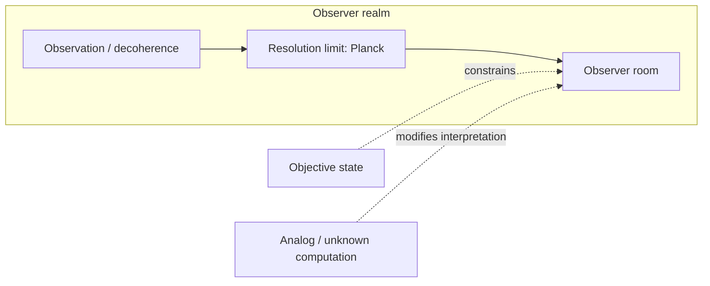

## Preface

This manuscript presents an operational framework built around the Planck scale, the observer as a receiver/emitter of information, consciousness as a translation layer (API), and information bounds, with extensions to API manipulation and perceptual materialization.

**Purpose.** The text develops (i) a scientific structure of definitions, postulates, and proof/refutation scope for "Planck as the realm of the current observer"; (ii) a hypothetical link between the consciousness-API and wavelength-dependent perception, including brain wave states; (iii) a materialization thesis—that photon emission in the right way or frequency can be interpreted by the API as matter—plus photon storage, and contrasts with quantum interference, slicing, and buffer overflow; and (iv) an information-theoretic foundation of spacetime: tensor networks, entanglement–geometry, information Lagrangian, emergence of Einstein gravity and Standard Model, and path toward a final theory of quantum gravity.

**Structure.** The manuscript is in four parts:

- **Part I — Planck as the Realm of the Current Observer** (REALMS): Definitions and conventions (D1–D5), postulates (P1–P4), observer vs. decoherence, Planck as realm, objective state and analog/unknown computation, Hard Theory, perception–consciousness–world deception, universe as information bound, summary diagram, and summary of claims and proof scope.
- **Part II — API Manipulation and Wavelength–Perception Hypothesis:** API as manipulable interface (virus bridge), interference by specific wavelengths, brain wave states (Delta, Theta, Alpha, Beta, Gamma), and synthesis.
- **Part III — Materialization Thesis:** Materialization thesis (light/photons observed as matter), correlation with REALMS and API-Manipulation, ways and frequencies, photon storage, contrast with quantum interference and slicing, and contrast with buffer overflow.
- **Part IV — Information-Theoretic Foundation of Spacetime:** Notation and postulates, tensor network model, quantum error correction, emergent geometry and spacetime dynamics, derivation of Einstein equations from entanglement, information Lagrangian, quantum geometry fluctuations, emergence of gauge and matter fields, quantum gravity and superposition of geometries, cosmological implications, and research program toward a final theory.

A detailed table of contents follows on the next page (generated automatically in the PDF).

**How to read.** The document is written in a scientific style. Where marked as hypothetical or conjectural, it should be read as such. Part I uses numbered definitions (D1–D5), postulates (P1–P4), and explicit "Proof and refutation scope" subsections. Parts II, III, and IV extend Part I and refer back to it (e.g. D4, P3, D5, P4, receiver/emitter).

**Conventions.** Equations use standard inline notation ($...$). Cross-references to REALMS (e.g. D4, P3) and between parts are used where relevant. The keyword index at the end points to sections where important terms are introduced or discussed.

# Part I — Planck as the Realm of the Current Observer

## Abstract

We present an operational framework in which (i) the Planck scale defines the resolution limit—the "realm" or "room"—of any observer in the semiclassical regime; (ii) observation is identified with environmental interaction (decoherence), with no necessary role for consciousness in collapse; (iii) the human observer is modelled as a receiver/emitter of information (frequencies), with consciousness as the translation layer (API) mapping sensed waves to brain states; and (iv) the universe is characterised as an information bound (entropy/state limits in finite regions) as well as a matter-bound. The framework is operational and does not assert fundamental ontology (e.g. whether the universe is analog, digital, or rests on unknown computation). All major claims are accompanied by an explicit proof and refutation scope.

---

## 1. Definitions and conventions

### 1.1 Notation

- **Planck units:** $l_P = \sqrt{\hbar G / c^3}$, $t_P = \sqrt{\hbar G / c^5}$, $E_P = \sqrt{\hbar c^5 / G}$, $\nu_P = 1/t_P \approx 1.85 \times 10^{43}\,\text{Hz}$. Numerical: $l_P \approx 1.62 \times 10^{-35}\,\text{m}$.
- **Entropy bounds:** Bekenstein $S \leq 2\pi R E/(\hbar c)$ (natural units); Bekenstein–Hawking $S_{\text{BH}} = A/(4 G_N) = A/(4 l_P^2)$ in Planck units.
- **Uncertainty and decoherence:** $\Delta E \, \Delta t \gtrsim \hbar$; $\tau_D \sim \hbar / (\Delta E)^2$ (decoherence timescale).

### 1.2 Definitions

- **D1 (Observer):** A **resolution-bounded system** comprising environment and apparatus (and optionally a human) whose effective spatial and temporal resolution is bounded below by the Planck scale in the semiclassical regime. The "Current Observer" is this system, not necessarily a conscious agent.
- **D2 (Room):** The **realm**, **frame**, or **scale** of an observer: the resolution limit and reference system within which physical descriptions are defined. Not necessarily a literal spatial enclosure.
- **D3 (Observation):** **Environmental interaction** that leads to decoherence: entanglement of the system with the environment, suppression of interference, and selection of pointer states. No consciousness is required in the definition.
- **D4 (Consciousness):** The **API** (translation layer) that maps sensed information waves—signals picked up by the human senses (sensors)—to brain states. The human observer is accordingly a **receiver/emitter** of those frequencies.
- **D5 (Information bound):** The **entropy or state limit** for a finite spatial region with finite energy: the maximum number of distinct physical states (or equivalent information content) that can be associated with that region, as given by Bekenstein-type or holographic bounds.

---

## 2. Postulates

- **P1 (Planck resolution limit):** In the semiclassical regime, the resolution of any observer (in the sense of D1) is bounded below by the Planck length $l_P$ and Planck time $t_P$. Finer resolution requires a theory of quantum gravity (e.g. loop quantum gravity, string theory).
- **P2 (Decoherence suffices):** Decoherence (environmental interaction, D3) suffices for effective collapse to a pointer state; no consciousness or privileged observer is required for the appearance of a single outcome.
- **P3 (Human observer as receiver/emitter):** The human observer is a **receiver/emitter** of information (frequencies). Consciousness (D4) is the API that translates these signals to brain states and does not cause quantum collapse.
- **P4 (Finite region, finite information):** Any finite region of space with finite energy has a finite entropy and hence finite information content (Bekenstein-type bound). The primary constraint on physical content is the information bound, with matter and fields as carriers.

---

## 3. Observer vs. decoherence and scope of observation

Under the definitions and postulates above, the following implications hold.

The notion of a "Current Observer" that requires a conscious or localised entity to "observe" is replaced by **observation as environmental interaction** (D3). The environment continuously entangles with the system, suppresses interference, and selects pointer states; no consciousness or privileged observer is needed (P2). Defining the Planck scale as the observer's realm (D2, P1) therefore does not over-emphasise a conscious observer over the **objective state** of the universe: the "room" is a **resolution/frame** constraint, not a claim that reality is observer-created. The framework remains compatible with the possibility that the universe is **analog** or based on a **type of computation we do not yet understand**; in that case the Planck scale is the effective resolution of any finite process in our descriptions, not necessarily the ontological grain.

**Summary:** We take decoherence seriously (observation = environmental interaction); we treat the Planck scale as the observer's realm in the sense of resolution/frame (P1, D2); we reconcile this with no fundamental consciousness-dependence (P2, P3) and with analog or unknown-computation scenarios.

---

## 4. Planck as realm of the current observer

### 4.1 Basis (theoretical and empirical footing)

**Planck scale as resolution limit (P1).** The Planck length $l_P$ and time $t_P$ mark the scale at which spacetime is expected to become "foamy" due to quantum fluctuations. Below this scale, classical notions of length and time break down, and the observer's frame cannot resolve finer detail without quantum gravity. Thus $l_P$ and $t_P$ define the **resolution limit** of any description that stays within semiclassical gravity.

**Observer effects at Planck scale.** In relativistic quantum mechanics, the observer's motion (e.g. accelerated frame) induces perceived time dilation and, in quantum settings, superposition of proper times. The inverse Planck time $\nu_P = 1/t_P \sim 10^{43}\,\text{Hz}$ acts as a universal "tick rate" or conversion factor for the finest temporal resolution in this framework.

**Operational view.** If time is the period between states and energy is treated in a binary (qubit-like) way, the Planck scale sets the **minimal "room"** (D2) for measurement: the coarsest scale at which the observer's description remains well-defined. State transitions may be conceived as occurring on timescales of order $t_P$, governed by energy quanta.

**Equations:**

- $l_P = \sqrt{\hbar G / c^3}$, $t_P = \sqrt{\hbar G / c^5}$, $E_P = \sqrt{\hbar c^5 / G}$, $\nu_P = 1/t_P \approx 1.85 \times 10^{43}\,\text{Hz}$.
- At the limit: $\Delta t \gtrsim t_P$ for temporal resolution; $\Delta E \, \Delta t \gtrsim \hbar$ with $\Delta t \sim t_P$ implies $\Delta E \sim E_P$.

### 4.2 Bias

The framework **emphasises** the observer's frame and resolution (Planck as room), an operational and information-theoretic reading of quantum mechanics, and a possible resolution interpretation at $l_P$/$t_P$. It **leaves open** whether the universe is fundamentally digital or analog and whether our notion of "computation" is adequate at the Planck scale. It **takes a stance** on consciousness: consciousness is the API (D4); the observer is a receiver/emitter (P3), not the cause of collapse.

### 4.3 Derived claims and conjecture

- **Claim 1:** The resolution of any observer (D1) in the semiclassical regime cannot exceed the Planck scale. *From P1 and the definition of observer.*
- **Claim 2:** The inverse Planck time $\nu_P$ is the natural upper bound on "tick rate" for any process described within this resolution limit. *From P1 and the definition of $t_P$.*
- **Conjecture 1:** The Planck scale is the effective resolution limit for any finite process. *Not derived; open if spacetime is analog or rests on unknown computation.*

### 4.4 Proof and refutation scope

- **Derivable from postulates:** Claims 1 and 2 follow from P1 and D1–D2.
- **Empirically testable:** Indirectly, via quantum-gravity or high-energy regimes where Planck-scale effects might become relevant; consistency of semiclassical physics with no sub-Planck resolution.
- **Refutable:** Observation of stable sub-Planck resolution in a controlled experiment would challenge P1.
- **Undecidable:** Whether the limit is ontological or only epistemic (analog vs. discrete substrate).

---

## 5. Objective state, analog, unknown computation

### 5.1 Observer vs. objective state

The "room" (D2) is a **resolution/frame** constraint, not a claim that reality is only observer-created. An objective state can exist; the Planck scale is the **limit of resolution** for any observer in this framework (P1), not the sole cause of reality. The observer's realm is the condition for *describing* the world at that scale, not the condition for the world to *be*.

### 5.2 Decoherence

Observation (D3) does the work of decoherence. The "Current Observer" is the localised system (apparatus plus environment) whose effective resolution is bounded by Planck (D1, P1). Consciousness is not required for decoherence (P2); the "room" is the resolution of that system.

### 5.3 Analog and unknown computation

- **Analog universe:** The Planck scale can still be the **effective** resolution of any finite observer or finite process—the scale at which our descriptions run out—even if the underlying dynamics are continuous. The room is then an epistemic/operational limit.
- **Unknown computation:** If the universe rests on computation we do not yet understand, Planck units may be **emergent** rather than fundamental "pixel size." The room remains the observer's effective scale (D2).

### 5.4 Proof and refutation scope

- **Derivable:** The distinction between resolution limit and ontology follows from P1 and D2.
- **Refutable:** Not directly; this is a conceptual distinction. Empirical evidence that reality has no objective state would conflict with the framework’s intent.
- **Undecidable:** Whether the universe is analog or digital, or what "computation" means at the fundamental level.

---

## 6. Hard Theory: theories, equations, puzzles

**"Hard Theory"** denotes the **hard problem of consciousness** (why and how experience arises from physical process) and the **hard limits of physical theory** (Planck scale, measurement, irreversibility).

### 6.1 Theories

- **Quantum measurement problem:** Unitary evolution vs. collapse; role of observer/environment; pointer states and decoherence. Under P2, decoherence suffices for effective collapse; the observer is resolution-bounded (D1), not necessarily conscious.
- **Planck-scale physics:** Quantum gravity and the meaning of "below" $l_P$/$t_P$—whether there is physics at finer scales or whether the observer's room is the final resolution (Conjecture 1).
- **Hard problem of consciousness:** Under P3 and D4, observation is framed as resolution/frame (environment + apparatus); consciousness is the **API** that translates universal information waves picked up by the senses and maps them to brain states. The user-observer is a **receiver/emitter** of those frequencies, not a privileged source of collapse.

### 6.2 Equations and relations

- Planck units: $l_P$, $t_P$, $E_P$, $\nu_P$ (see §1.1, §4.1).
- Uncertainty at the limit: $\Delta E \, \Delta t \gtrsim \hbar$; $\Delta t \sim t_P$ $\Rightarrow$ $\Delta E \sim E_P$.
- Decoherence timescale: $\tau_D \sim \hbar / (\Delta E)^2$; when $\Delta E \sim E_P$, $\tau_D \sim t_P$, linking decoherence to the Planck room.

### 6.3 Puzzles and framework answers

- **Measurement puzzle:** How does a single outcome appear from unitary evolution? The framework favours a resolution-bounded, environment-inclusive observer (D1, P2) without requiring consciousness.
- **Planck puzzle:** Is there physics below the Planck scale? The framework leaves this open: the room is the *effective* resolution (Conjecture 1); ontology may be analog or unknown-computation.
- **Consciousness puzzle:** Is the Current Observer necessarily conscious? Under D4 and P3, the observer is a receiver/emitter; consciousness is the API that maps sensed waves to brain states. The room is resolution-bounded (environment + apparatus); consciousness does not cause collapse but translates what is received and emitted.

### 6.4 Proof and refutation scope

- **Derivable:** That decoherence can account for effective collapse (P2); that consciousness need not enter the collapse mechanism (P3, D4).
- **Empirically testable:** Predictions of decoherence theory; consistency of pointer states with observation.
- **Refutable:** Evidence that collapse requires consciousness would challenge P2/P3.
- **Undecidable:** Why there is something like an API at all (hard problem of consciousness).

---

## 7. Perception–consciousness–world deception

### 7.1 Theories

- **Veil of perception:** We have access to appearances (the phenomenal world), not necessarily to "things in themselves." The observer's room (D2) is both perceptual/cognitive resolution and physical (Planck): we operate within a resolution limit at every level.
- **Cognitive and perceptual bias:** Evolution and neurobiology fix the scales we can resolve (e.g. mesoscopic). The world may have structure at Planck scale or other scales that we do not perceive as such. "Deception" here means **resolution-limited access**, not literal falsehood.
- **Consciousness and "deception":** Consciousness (D4), as the API mapping sensed information waves to brain states, operates at a coarse-grained, post-decoherence level. The "world we perceive" is a **construction** at that level—resolution-dependent and filtered by what the receiver/emitter can resolve. "World deception" = **resolution-limited access** via the sensory API.

### 7.2 Equations and relations

- Information-theoretic bounds: channel capacity, discrimination limits—how much information can be resolved by a system with finite resources.
- Decoherence selects the "perceived" pointer basis; the perceived world is the world in the basis that survives decoherence.
- If state transitions occur at $t_P$, then $t_P$ is the limit of what could in principle be "perceived" by any process bounded by that resolution.

### 7.3 Derived claim

- **Claim 3:** The conscious observer (human as receiver/emitter) operates at scales much coarser than Planck (mesoscopic, decohered). *From P1, P3, D4, and the neurobiological scale of sensory and neural processes.*

### 7.4 Proof and refutation scope

- **Derivable:** Claim 3 from postulates and scale of biology.
- **Empirically testable:** Psychophysics of discrimination limits; channel-capacity models of perception.
- **Undecidable:** Whether the "world" we perceive is "the same" as the world at Planck scale (scale-dependent description vs. "deception" is a matter of terminology).

---

## 8. Universe as information bound (vs. matter)

Seeing the universe as a **bound of information/data** (D5) rather than primarily as matter shifts the focus to how much can be resolved, stored, and transmitted within finite regions. Matter and fields are the carriers; the **bound** is the primary constraint (P4).

### 8.1 Basis: information as the bound

**Key equations:**

- **Bekenstein bound:** $S \leq 2\pi R E/(\hbar c)$ (natural units). Information scales with **surface area**, not volume.
- **Holographic entropy (Bekenstein–Hawking):** $S_{\text{BH}} = A/(4 G_N) = A/(4 l_P^2)$. The horizon area in Planck units counts orthogonal states; the region is maximally described by data on the boundary.
- **Covariant entropy bound (Bousso, Flanagan–Marolf–Wald):** Entropy through a light-sheet is bounded by the generating surface area in units of $4 G_N$.

### 8.2 Contrast: matter-bound vs. information-bound view

| Aspect | Matter-bound view | Information-bound view |
|--------|-------------------|-------------------------|
| **Primary quantity** | Mass, energy, fields in volume | Entropy, state count, data on boundary or in region |
| **Limit** | Conservation laws; UV cutoff | Bekenstein, holographic, CKN bounds; UV–IR linkage |
| **Gravity** | Fundamental force | Emergent (e.g. entropic; spacetime from entanglement) |
| **Practical probe** | Colliders, telescopes | Entropy budgets, horizon thermodynamics, channel capacities |

The information-bound view (P4) says the **cap** on what can exist in a region is set by information/entropy bounds; matter saturates or stays under that cap.

### 8.3 Recent support (2017–2024)

- **Banks (2020); Fields–Glazebrook–Marcianò (2022):** Holographic principle as consequence of quantum information theory; $\log(\text{dim}\,\mathcal{H})$ equals one-quarter of holographic screen area in Planck units.
- **Jacobson (1995); Svesko (2019); Alonso-Serrano–Liška (2020):** Einstein equations from $\delta Q = T\,dS$ on local horizons; entanglement equilibrium in causal diamonds; gravity and geometry emerge from entropy/entanglement.
- **ER = EPR (Verlinde 2020; Jafferis–Schneider 2021; Engelhardt–Liu 2023; 2024):** Spacetime connectivity tied to entanglement; $S \leq A/(4 G_N)$; Bekenstein–Hawking entropy as entanglement entropy.
- **CKN bound (Blinov–Draper 2021; thermodynamic origin 2022):** $\Lambda_{\text{IR}} \gtrsim \Lambda_{\text{UV}}^2 / M_P$; depletion of QFT degrees of freedom with scale; thermodynamic derivation; link to cosmological constant.
- **Verlinde (2017; 2019–2021):** Gravity as emergent from entanglement/entropy; Casini–Bekenstein bound and entropy gradients recover Newton and Einstein equations.
- **Vopson (2021):** Total information in visible matter $\sim 6 \times 10^{80}$ bits; $\sim 1.5$ bits per elementary particle; formula reproducing Eddington number.
- **Horizon entropy and cosmology (2020–2024):** Entanglement entropy of cosmological perturbations; quantum corrections to horizon entropy; mass–horizon relation with $M = \gamma (c^2/G) L^n$, $n=3$, equivalent to $\Lambda$CDM.

### 8.4 Practical-theoretical probes

- Entropy and horizon budgets (observable universe, cosmic horizon; compare Egan–Lineweaver, Vopson).
- CKN and precision QFT (Lamb shift, $g-2$, radiative neutrino masses).
- Emergent gravity tests (galaxy rotation, cluster dynamics vs. $\Lambda$CDM).
- ER = EPR in quantum simulators (tabletop realisations).
- Channel capacity and discrimination limits (observers as finite-capacity channels).
- Unimodular and entropic cosmology (early universe, horizon problem).

### 8.5 Derived claim

- **Claim 4:** The observable universe has a finite information content. *From P4 and Bekenstein/holographic bounds (e.g. Vopson’s $\sim 6 \times 10^{80}$ bits in matter; horizon entropy $\sim 2.6 \times 10^{122}\,k$).*

### 8.6 Proof and refutation scope

- **Derivable from postulates:** Claim 4 from P4 and standard bounds.
- **Empirically testable:** Entropy budgets; CKN and precision observables; emergent gravity; ER=EPR tabletop proposals.
- **Refutable:** Violation of Bekenstein-type bounds in a controlled setting would challenge P4.
- **Undecidable:** Whether the universe is "really" information or matter (ontology).

---

## 9. Summary diagram

- **Observation (decoherence)** → **Resolution limit (Planck)** → **Observer's room.**
- **Objective state** and **analog / unknown computation** modify the interpretation (fundamental vs. emergent, digital vs. analog) but do not remove the room.

---

## 10. Summary of claims and proof scope

| Claim | Source | Proof scope |
|-------|--------|-------------|
| Resolution of any observer bounded below by Planck scale | P1, D1 | Derived |
| $\nu_P$ as upper bound on tick rate in this framework | P1, $t_P$ | Derived |
| Planck scale is effective resolution limit for any finite process | Conjecture 1 | Undecidable (open if analog/unknown computation) |
| Observable universe has finite information content | P4, Bekenstein/holographic bounds | Derived |
| Conscious observer operates at coarser-than-Planck scale | P1, P3, D4, neurobiological scale | Derived |
| Decoherence suffices for effective collapse; no consciousness required | P2 | Derived; refutable if consciousness shown necessary for collapse |
| Human observer is receiver/emitter; consciousness is API | P3, D4 | Postulate; refutable if collapse requires consciousness |
| Why there is something like an API (hard problem) | — | Undecidable |
| Universe "really" information vs. matter | — | Undecidable (ontology) |

---

## 11. File and format

This document is a single Markdown file. Equations use `$...$` (inline) and `$$...$$` (display) for LaTeX-style math. Structure: Abstract; Definitions and conventions (§1); Postulates (§2); Observer vs. decoherence (§3); Planck as realm (§4); Objective state, analog, unknown computation (§5); Hard Theory (§6); Perception–consciousness–world deception (§7); Universe as information bound (§8); Summary diagram (§9); Summary of claims and proof scope (§10); File and format (§11).

# Part II — API Manipulation and Wavelength–Perception Hypothesis

## Abstract

This sheet extends the framework in [REALMS.md](REALMS.md) by **theoretically hypothesizing** that (i) the consciousness-API (REALMS D4)—the translation layer that maps sensed information waves to brain states—can be manipulated, analogous to a **bridge for a computer virus** (corruption or injection of the translation layer); (ii) perception can be **interfered with or disrupted by specific wavelengths** (external or internal); and (iii) this picture **correlates with measurable brain wave states**: Delta, Theta, Alpha, Beta, and Gamma. The document is explicitly hypothetical and does not alter REALMS.md.

**Reference to REALMS:** In REALMS.md, consciousness is defined as the API (D4) mapping sensed waves to brain states, and the human observer is a **receiver/emitter** of those frequencies (P3). Here we assume that this interface is in principle **manipulable**—by external wavelengths, internal noise, or malformed inputs—and that such manipulation can disrupt "correct" perception.

---

## 1. Hypothesis 1: API as manipulable interface (virus bridge)

If consciousness is an API (translation layer between sensed waves and brain states), then it has:

- **Inputs:** Sensory channels (electromagnetic, acoustic, chemical, or other waveforms) that provide the raw signal to the translation layer.
- **Mapping rules:** The process that maps sensor data to neural representation and hence to subjective experience.
- **Outputs:** Brain states and the resulting perception or cognition.

Any such interface can in principle be:

- **Spoofed:** Inputs replaced or overridden by external signals, so that the API receives fabricated or altered data (e.g. phantom sensations, induced imagery).
- **Corrupted:** Mapping rules distorted—e.g. by injury, disease, or hypothetical external drive—so that even "correct" inputs are translated incorrectly (e.g. misperception, hallucination, bias).
- **Flooded:** Channel capacity exceeded (cf. information bound in REALMS); the API is overwhelmed, leading to degraded or biased perception (e.g. confusion, suggestibility).

**Virus analogy:** A computer virus exploits an interface (buffer overflow, code injection, malicious input). By analogy, a **perceptual or cognitive "virus"** would be a pattern of input—e.g. specific wavelengths, repetition, or timing—that exploits the API so that the translation no longer reflects "correct" or intended perception (e.g. hallucination, fixed belief, or heightened suggestibility). This is a **theoretical hypothesis**, not an established fact.

**Definitions (for this sheet):**

- **API manipulation:** Any process that alters the normal mapping from sensed waves to brain states so that perception or cognition is disrupted or controlled.
- **Bridge:** The point of entry (sensory channel or neural pathway) through which such manipulation can occur—the analogue of the vulnerable interface in the virus case.

---

## 2. Hypothesis 2: Interference and disruption by specific wavelengths

Perception can be interfered with or disrupted by **specific wavelengths** (or frequency bands). This can be:

- **External:** Electromagnetic or other physical waves in the environment that couple to the senses or nervous system—e.g. light flicker, RF fields, infrasound, ultrasound—and alter neural activity or the effective input to the API.
- **Internal:** Endogenous oscillations (brain waves) in certain bands that bias what the API "receives" or how it integrates information—e.g. dominant Alpha gating sensory input, or Gamma correlating with binding and coherent perception.

**Correct perception** is defined here in operational terms: e.g. consistency with shared measurement, coherence with prior experience, or stability under redundant cues. **Disruption** is then a deviation from such a baseline under controlled wavelength exposure or under abnormal brain-wave states.

**Hypothesis (explicit):** There exist wavelength bands (external and/or internal) such that exposure or dominance of those bands **increases the likelihood** of API manipulation (spoofing, corruption, or flooding), and hence of disrupted perception. This is testable in principle—e.g. by psychophysics combined with EEG under controlled stimulation.

---

## 3. Brain wave states: Delta, Theta, Alpha, Beta, Gamma

The following bands are **established** in neuroscience (EEG); their exact cognitive roles are partly established and partly under research. The **hypothesized** link to API manipulation is our extension.

| Band | Approx. frequency range | Typical state / correlate | Hypothesized role in API manipulation / perception disruption |
| --- | --- | --- | --- |
| **Delta** | $\sim 0.5$–$4\,\text{Hz}$ | Deep sleep, restorative; low awareness | Low vigilance; API may be more susceptible to spurious or dream-like input; reduced "correct" grounding. |
| **Theta** | $\sim 4$–$8\,\text{Hz}$ | Drowsiness, meditation, memory; edge of awareness | Boundary state; candidate for increased suggestibility or intrusion of internal imagery. |
| **Alpha** | $\sim 8$–$13\,\text{Hz}$ | Relaxed wakefulness, eyes closed; gating of sensory input | Strong Alpha may "open the gate" for suggestion or external drive when normal sensory check is reduced. |
| **Beta** | $\sim 13$–$30\,\text{Hz}$ | Alertness, focus, active thinking | Typical waking state; baseline for "correct" perception; suppression or instability may favor disruption. |
| **Gamma** | $\sim 30$–$100+\,\text{Hz}$ | Binding, attention; possibly consciousness-related | Coherent perception and binding; disrupted Gamma may impair correct integration and hence "correct" perception. |

**Correlation with perception and API:** The measurable brain wave states are **candidates for the internal "wavelength"** side of the hypothesis: they are the endogenous rhythms that (i) can be influenced by external wavelengths (e.g. flicker, binaural beats), and (ii) may determine how robust or how vulnerable the API is to manipulation—e.g. which band dominates may predict susceptibility to spoofing or confusion. We hypothesize that dominance or suppression of a given band can **favor or hinder** certain kinds of API behavior; this is a candidate mechanism, not proof.

---

## 4. Synthesis and scope

**Synthesis:** API manipulation (virus-bridge) + wavelength-specific interference + brain wave bands form a **single hypothetical picture**: the observer is a receiver/emitter (REALMS P3); the API is the translation layer (REALMS D4); that layer can in principle be manipulated (Hypothesis 1); such manipulation may be mediated or reflected by specific wavelengths (Hypothesis 2) and by the measurable brain wave states—Delta, Theta, Alpha, Beta, Gamma (Section 3). Disruption of "correct" perception is then the observable correlate of successful manipulation or of unfavorable wavelength/band conditions.

**What is hypothesis vs. established:**

- **Established:** EEG bands and their approximate frequency ranges; rough cognitive correlates (e.g. Alpha with relaxed wakefulness, Gamma with binding). Real-world examples of perception altered by external stimuli (e.g. flicker, suggestion) or by brain state (e.g. sleep, injury).
- **Hypothetical:** The API as a manipulable interface; the "virus" and "bridge" analogy; the claim that specific wavelengths or band dominance **systematically** increase the likelihood of API manipulation or perception disruption; the detailed roles in the table above.

**Proof and refutation scope:** Controlled experiments that combine (i) wavelength or band-specific stimulation (external or entrainment), (ii) EEG recording of brain wave states, and (iii) behavioral or subjective measures of perception (accuracy, suggestibility, binding) could in principle **support** the hypothesis (e.g. correlation between band state and susceptibility) or **refute** it (e.g. no such correlation under controlled conditions). Replication and pre-registration would be required for credible evidence.

---

## 5. File and format

This document is a standalone Markdown sheet. It references [REALMS.md](REALMS.md) for the definitions of API (D4), receiver/emitter (P3), and observer. Math uses $...$ for inline expressions (e.g. frequency ranges in Hz).

# Part III — Materialization Thesis

## Abstract

This document introduces a **materialization thesis**: that light/photons emitted in a specific way or at a specific frequency (or spatiotemporal pattern) can be **interpreted or "observed" by the API as matter**. "Materialization" here is **perceptual**—the API maps the photon input to the same kind of experience as when observing physical matter—not a claim that mass-energy is created. The thesis correlates with [REALMS.md](REALMS.md) (observer as receiver/emitter, consciousness as API) and with the [API-manipulation hypothesis](REALMS-API-Manipulation.md) (wavelength/frequency as the lever for what the API does).

**References to prior docs:** In REALMS.md, consciousness is the API (D4) mapping sensed waves to brain states, and the human observer is a **receiver/emitter** (P3). In REALMS-API-Manipulation.md, the inputs to the API are sensory channels (including electromagnetic), and specific wavelengths can spoof or alter perception. The **same interface** that can be manipulated is the one that **interprets** photon emission as matter when the emission matches what the API "expects" for matter—e.g. reflected or emitted light from surfaces, with the right spectral and temporal structure.

---

## 1. Materialization thesis (core claim)

**Thesis (explicit):** There exist **ways of emitting light/photons**—characterised by wavelength(s), frequency, intensity, spatial distribution, temporal pattern, and/or coherence—such that the human observer's API **interprets** or **"observes"** that emission **as matter** (or as a materialized object or event). That is, the API produces the same or similar brain state (and hence experience) as when the observer is looking at physical matter (e.g. a solid object), even if the physical cause is only photons arranged in that way (e.g. a screen, a hologram, or a structured light field).

**Distinction:**

- **Physical materialization:** Creation of mass-energy (e.g. particles or fields where none existed). This document **does not assert** physical materialization.
- **Perceptual / observational materialization:** The API's mapping of photon input to the "matter present" representation. The observer experiences something as materialized because the translation layer (API) outputs the corresponding brain state. **This is what the thesis is about.**

**Mechanism (hypothetical):** Normal perception of matter involves photons (reflected or emitted from surfaces) reaching the eye with certain spectral, spatial, and temporal signatures. The API has evolved (or is tuned) to map those signatures to "object" / "matter." If we **emit light** that replicates or sufficiently approximates those signatures, the API will **interpret** it as matter—no need for a physical object to be there. So "materialization" in the observational sense is **sufficient photon structure** that triggers the matter interpretation in the API.

---

## 2. Correlation with REALMS and API-Manipulation

### 2.1 REALMS

In REALMS.md, the observer is a receiver/emitter (P3); consciousness is the API (D4) that maps sensed waves to brain states. The "sensed waves" for vision are electromagnetic (photons). So **what we call "observing matter"** is already the API mapping a certain photon stream to a certain brain state. The materialization thesis is then: **another** photon stream, with the right structure, can be **observed** (mapped) by the same API **as if it were matter**. No new physics is required—only the recognition that the same mapping that gives us "object there" when light reflects from a table can give us "object there" when light is emitted by a display with the right pattern.

### 2.2 API-Manipulation

REALMS-API-Manipulation.md hypothesizes that the API can be **spoofed** (inputs replaced or overridden by external signals). Perceptual materialization is a **benign or intentional form of spoofing**: we supply photon input that is not "from" a solid object but is **structured so that** the API's mapping yields "object present" / "matter." So the thesis fits the same framework—wavelength and pattern of light determine what the API outputs (matter-like experience or not). The **readiness** of the API to interpret input as matter may also depend on brain wave state (e.g. Alpha, Gamma, suggestibility, binding), as in REALMS-API-Manipulation: the same photon pattern might be interpreted more or less strongly as "matter" depending on the observer's band dominance.

---

## 3. Ways and frequencies: what could count

### 3.1 Concrete examples (established)

Screens and projectors already "materialize" images by emitting light that the visual system interprets as objects (2D or with depth cues). Holograms and volumetric displays go further toward "observing as matter" in 3D. The thesis is therefore already **partially instantiated** by existing technology; this document frames the thesis as the **general principle** of which these are cases.

### 3.2 Frequency and wavelength

The API (visual pathway) is sensitive to:

- **Spectral content:** Wavelength in the visible range (roughly $400$–$700\,\text{nm}$).
- **Temporal pattern:** Frequency in time—e.g. refresh rate, flicker—that can affect fusion and perceived stability.
- **Spatial pattern:** Resolution, parallax, depth cues (binocular, motion, occlusion) that the API uses to infer "object" vs. "flat surface."

So "emitting light in a way or frequency" includes all of these. The thesis says: **some** combination is **sufficient** for the API to interpret the emission as matter (perceptual materialization). Other bands (e.g. RF) do not directly drive the visual API but could indirectly affect neural state (as in REALMS-API-Manipulation), potentially altering how readily the API attributes "matter" to a given photon stream.

### 3.3 Hypothetical extension

One can hypothesize that **specific frequencies or patterns** (within or beyond current display tech) might **optimize** or **strengthen** the "matter" interpretation—e.g. certain temporal frequencies that align with Alpha or Gamma and increase binding, so that the observer experiences the lit structure as more "solid" or present. This ties back to REALMS-API-Manipulation (wavelength + band state).

---

## 4. Synthesis and scope

**Synthesis:** Perceptual materialization = **photon emission** (way / frequency / pattern) + **API interpretation** (mapping to "matter present"). The observer "observes" materialization when the API receives that photon structure and produces the corresponding experience. The same physical story holds (photons → retina → brain); the thesis is that **control over the photon stream** implies **control over whether the API "sees" matter.**

**What is hypothesis vs. established:**

- **Established:** Screens, projectors, and holograms already produce matter-like perception. Vision science confirms that the brain infers "object" from structured light (spectral, spatial, temporal).
- **Hypothetical:** The general principle that **any** sufficient photon structure can be observed as matter (to the limit of the API's resolution and channel capacity); and that specific frequencies or patterns might **optimize** the matter interpretation (e.g. via alignment with brain wave bands).

**Proof and refutation scope:** Existing display technology already supports the thesis. Refutation would require showing that no possible photon emission can be interpreted by the API as matter—which would contradict everyday experience with screens and holograms. The thesis does **not** assert that "materialization" in paranormal or religious contexts is true or false; it only states that **in principle** the same API mechanism (photon structure → "matter present" experience) could apply, with the source of the photon pattern left open.

---

## 5. Physically backed thesis: hypothetical "photon storage"

**Idea:** Luminescence-like materials (e.g. phosphors, persistent phosphors, or other systems that absorb incident light and re-emit it later) effectively **store** photons: they absorb light when directly illuminated and release it over time (delayed emission, afterglow). This is a **physically grounded** mechanism—well established in optics and materials science—for "photon storage" in the sense of absorbing and later re-emitting electromagnetic energy.

**Hypothesis:** Could such storage **ease memory limits** inside the "elegant objects" of the Planck / observer "system"? In REALMS.md, the observer's "room" is resolution-bounded (Planck scale); the universe is characterised by **information bounds** (finite entropy per finite region). If the observer system—or any subsystem that processes photon input—has a finite "memory" or buffer (channel capacity, state count), then **storing** photons in luminescent media instead of requiring continuous real-time emission could, in principle, **spread the load**: information (light) is absorbed, held, and released when needed, rather than all at once. That could reduce peak demand on the "system" and thus help stay within its limits. So photon storage (absorb/emit materials) is a **candidate mechanism** for mitigating memory or throughput limits in a system that observes or processes light—hypothetically including the observer's API and its resolution-bound "room" (REALMS D2, P1).

**Scope:** This is a **hypothetical** application of known physics (luminescence) to the framework; no claim that the brain or the "system" literally uses such materials. The claim is that **if** the observer system has memory/throughput limits, then physical photon storage (absorb/emit) is one way such limits could in principle be relaxed.

---

## 6. Contrast with quantum mechanical interference and "slicing" principles

**Quantum mechanical interference:** In QM, light and matter exhibit interference—superposition of paths or states, with phase-sensitive addition. Observation (measurement) typically "collapses" or selects an outcome; before that, the system is in a superposition. Interference is **delocalized** and **coherent**; which-path information destroys the pattern.

**"Slicing" principles:** One can think of "slicing" as (i) **temporal slicing**: discrete time steps (e.g. at the Planck scale $t_P$, as in REALMS) at which the system state is updated or observed; (ii) **resolution slicing**: the observer's room (REALMS D2) only resolves down to $l_P$, $t_P$, so finer structure is "sliced off" or coarse-grained; (iii) **basis slicing**: measurement chooses a basis, "slicing" the state space into one outcome. In each case, something continuous or superpositional is reduced to a discrete or definite slice.

**Contrast with photon storage:** Photon storage via luminescence is **localized** and **absorb-then-emit**: the material absorbs photons (energy), stores it in excited states, and re-emits later. There is no requirement for coherent superposition across the stored light; the process is often treated classically or semiclassically (rate equations, decay times). So we **contrast**: (a) **QM interference** = coherent, delocalized, phase-sensitive; **photon storage** = localized, absorb/emit, can be incoherent. (b) **Slicing** = discrete resolution or basis choice that limits what is "seen"; **photon storage** = a way to **extend** what is available over time (spread the signal) rather than to cut it down. Slicing reduces the state or the resolution; storage spreads the same information in time, potentially easing limits that would otherwise force a slice (e.g. drop or truncate data).

---

## 7. Contrast with theoretical "buffer overflow" and observer-system collapse

**Buffer overflow:** In REALMS-API-Manipulation.md, the API can be **flooded**—channel capacity exceeded (information bound), leading to degraded or biased perception. In computing, a buffer overflow occurs when input exceeds the allocated buffer; the excess can overwrite adjacent memory and cause undefined behavior or **collapse** of the program. By analogy, a **theoretical "buffer overflow"** in the current observer's system would be: input (e.g. photon flux, sensory data, or internal state count) **exceeds** the system's capacity (the observer's "room," channel capacity, or information bound). The result could be **collapse** in the sense of (i) **cognitive/perceptual collapse**: overload, confusion, loss of coherent perception, or failure to integrate; or (ii) **structural collapse**: the resolution-bounded system (REALMS D1) can no longer maintain a well-defined state—e.g. irreversibility, decoherence run amok, or a breakdown of the API's mapping.

**Contrast with photon storage:** Photon storage (Section 5) is a **mitigation** strategy: by absorbing and holding light, then releasing it over time, the system can avoid **peak** input that would otherwise exceed the buffer. So **storage** = spread load, stay within capacity. **Buffer overflow** = exceed capacity, risk collapse. The two are **opposite** in intent: storage aims to keep the system within its limits; overflow is what happens when those limits are breached. In the same framework, **slicing** (Section 6) can be seen as another response to limits—impose a finite resolution or basis so that the system never has to represent more than it can hold. Storage extends capacity in time; slicing restricts what is represented; overflow is the failure mode when neither is sufficient.

---

## 8. File and format

This document is a standalone Markdown sheet. It references [REALMS.md](REALMS.md) (D4, P3) and [REALMS-API-Manipulation.md](REALMS-API-Manipulation.md). Math uses $...$ for inline expressions (e.g. wavelength ranges). Sections 5–7 append: photon storage (luminescence), contrast with QM interference and slicing, and contrast with buffer overflow.

# Part IV — Information-Theoretic Foundation of Spacetime

## Abstract

We propose a framework in which spacetime, gravity, and matter emerge from a fundamental network of quantum information. The primary physical object is a global quantum state whose entanglement structure defines geometry. Holographic entropy bounds constrain the maximal information content of spacetime regions (consistent with REALMS D5, P4).

Within this framework spacetime geometry arises from the structure of entanglement, bulk physics is encoded via quantum error correction, and gravitational dynamics emerges from entropy extremization.

We outline a path toward a complete theory including the dynamical law of the information network, the emergence of Standard Model fields, and a fully quantized theory of gravity.

---

## 1. Notation

### 1.1 Planck units

We define the Planck scale (as in REALMS P1 and §1.1) as

$$
l_P = \sqrt{\frac{\hbar G}{c^3}}, \quad
t_P = \sqrt{\frac{\hbar G}{c^5}}, \quad
E_P = \sqrt{\frac{\hbar c^5}{G}}, \quad
\nu_P = \frac{1}{t_P}.
$$

Numerically:

$$
l_P \approx 1.62 \times 10^{-35}\,\text{m}, \qquad
\nu_P \approx 1.85 \times 10^{43}\,\text{Hz}.
$$

The Planck length defines the minimal geometric resolution of spacetime.

### 1.2 Entropy bounds

Information content of physical systems obeys fundamental limits.

**Bekenstein bound:**

$$
S \leq \frac{2\pi R E}{\hbar c}
$$

**Bekenstein–Hawking entropy:**

$$
S_{\text{BH}} = \frac{A}{4 G_N} = \frac{A}{4 l_P^2}
$$

(in Planck units). Thus the maximal information content of a region scales with its boundary area.

### 1.3 Uncertainty and decoherence

Energy–time uncertainty:

$$
\Delta E \, \Delta t \gtrsim \hbar
$$

Decoherence timescale:

$$
\tau_D \sim \frac{\hbar}{(\Delta E)^2}
$$

This scale governs the transition from quantum information dynamics to classical spacetime.

---

## 2. Fundamental postulates

### 2.1 Postulate 1: Information primacy

The fundamental physical object is a global quantum state

$$
|\Psi\rangle \in \mathcal{H}
$$

defined on an information network of quantum degrees of freedom. All physical observables emerge from correlations within this state.

### 2.2 Postulate 2: Holographic information limit

For any physical region

$$
S \leq \frac{A}{4 l_P^2}
$$

Thus bulk physics is redundantly encoded on lower-dimensional boundaries (REALMS D5, P4).

### 2.3 Postulate 3: Entanglement defines geometry

Let $A$ and $B$ be subsystems. Define mutual information

$$
I(A:B) = S(A) + S(B) - S(A \cup B)
$$

We define an effective geometric distance

$$
d(A,B) \sim -\log I(A:B)
$$

Thus stronger entanglement corresponds to smaller geometric distance.

---

## 3. Information network structure

We represent the fundamental system as a tensor network

$$
T_{i_1 i_2 \ldots i_n}
$$

with graph structure

$$
G = (V,E)
$$

where

- nodes correspond to quantum subsystems
- edges represent entanglement channels

The emergent geometry corresponds to the minimal cut structure of the network.

---

## 4. Tensor network model of spacetime

We model the microscopic structure of spacetime as a tensor network defined on a graph $G = (V,E)$ where $V$ are quantum subsystems and $E$ represent entanglement links.

Each vertex carries a tensor $T^{i_1 i_2 \ldots i_k}$ mapping incoming indices to outgoing indices. The global quantum state is

$$
|\Psi\rangle = \sum_{i_1 \ldots i_n} \prod_v T_v^{i_{v1} \ldots i_{vk}} |i_1 \ldots i_n\rangle
$$

Edges correspond to maximally entangled states

$$
|\Phi^+\rangle = \frac{1}{\sqrt{d}} \sum_i |i\rangle |i\rangle
$$

The geometry emerges from minimal cuts of the network. If $\gamma$ is a cut through the network

$$
S = |\gamma| \log d
$$

Thus the entropy of a region is proportional to the number of edges crossing the cut. In the continuum limit

$$
S \rightarrow \frac{\text{Area}}{4G}
$$

recovering the entropy–area relation.

---

## 5. Quantum error correction structure

Bulk operators are encoded redundantly in boundary degrees of freedom. Define an encoding map

$$
\mathcal{E} : \mathcal{H}_{\text{bulk}} \rightarrow \mathcal{H}_{\text{boundary}}
$$

such that $\mathcal{E}^\dagger \mathcal{E} = I$. The code protects bulk information against loss of boundary degrees of freedom.

Bulk operator reconstruction obeys

$$
\mathcal{O}_{\text{bulk}} = \mathcal{R}_A(\mathcal{O}_{\text{boundary}})
$$

for multiple boundary regions $A$. This redundancy explains the robustness of spacetime geometry.

---

## 6. Emergent geometry

Entanglement entropy of a region $A$ satisfies

$$
S(A) = \frac{\text{Area}(\gamma_A)}{4 G_N}
$$

where $\gamma_A$ is a minimal surface (Ryu–Takayanagi). This relation links quantum information, geometry, and gravity.

---

## 7. Spacetime dynamics and information Lagrangian

The evolution of the information network follows a variational principle. Define an information action

$$
\mathcal{I} = \sum_{i,j} w_{ij} I(i:j)
$$

The physical configuration extremizes $\delta \mathcal{I} = 0$ subject to holographic entropy constraints.

Equivalently, define a fundamental action

$$
S_{\text{info}} = \int d\tau \, L_{\text{info}}
$$

with Lagrangian

$$
L_{\text{info}} = \sum_{i,j} J_{ij} I(i:j) - \lambda \sum_i S_i
$$

where $I(i:j)$ is mutual information, $S_i$ local entropy, and $J_{ij}$ coupling strengths. The dynamics extremizes $\delta S_{\text{info}} = 0$ subject to holographic bounds.

---

## 8. Derivation of Einstein equations from entanglement

Consider a small causal diamond. The entanglement entropy satisfies

$$
\delta S = \delta \langle H_{\text{mod}} \rangle
$$

where $H_{\text{mod}}$ is the modular Hamiltonian. For a spherical region

$$
H_{\text{mod}} = 2\pi \int \frac{R^2 - r^2}{2R} T_{00} \, dV
$$

Combining this with the entropy–area relation $S = A/(4G)$ gives $\delta S = \delta A/(4G)$. Relating area variations to curvature yields

$$
R_{\mu\nu} - \frac{1}{2} R g_{\mu\nu} = 8\pi G \, T_{\mu\nu}
$$

Thus Einstein gravity emerges from entanglement equilibrium (Jacobson-style).

---

## 9. Quantum geometry fluctuations

The spacetime metric emerges as an expectation value

$$
g_{\mu\nu} = \langle \Psi | \hat{g}_{\mu\nu} | \Psi \rangle
$$

Metric fluctuations correspond to entanglement fluctuations

$$
\delta g_{\mu\nu} \sim \delta I(A:B)
$$

Gravitons appear as collective modes of the entanglement network.

---

## 10. Emergence of gauge fields and matter

Internal symmetries of the network define gauge structures. Let the network possess symmetry group

$$
G = SU(3) \times SU(2) \times U(1)
$$

Define parallel transport operators $U_{ij} = \exp(i A_\mu \, dx^\mu)$ on network edges. Curvature corresponds to holonomy

$$
F_{\mu\nu} = \partial_\mu A_\nu - \partial_\nu A_\mu + [A_\mu, A_\nu]
$$

Thus gauge fields arise from phase transport across entanglement links.

Matter fields: localized excitations of the network state behave as particle fields. Define excitation operators $\psi^\dagger_i$ acting on network nodes. Fermionic statistics arise from topological constraints of the network state space. The effective field theory in the continuum limit reproduces the Standard Model Lagrangian.

---

## 11. Quantum gravity and superposition of geometries

The quantum gravitational Hilbert space is

$$
\mathcal{H}_{\text{grav}} = \bigotimes_i \mathcal{H}_i
$$

where each subsystem corresponds to Planck-scale degrees of freedom. Spacetime curvature emerges from fluctuations of entanglement connectivity. Gravitons correspond to collective excitations of the network.

The full quantum state is

$$
|\Psi\rangle = \sum_g c_g |g\rangle
$$

where $g$ denotes a graph geometry. Thus spacetime itself exists in quantum superposition. Classical spacetime corresponds to dominant saddle points or the thermodynamic limit $N \rightarrow \infty$.

---

## 12. Cosmological implications

The early universe corresponds to a low-entanglement network state. Cosmic expansion corresponds to growth of entanglement connectivity. Entropy growth drives the arrow of time.

---

## 13. Research program toward a final theory

A complete theory requires three ingredients.

**1. Dynamical law of the information network.** A microscopic Hamiltonian $H_{\text{info}}$ governing evolution of the network. Possible form $H_{\text{info}} = \sum_{ij} J_{ij} \sigma_i \sigma_j$ subject to holographic constraints.

**2. Emergence of Standard Model physics.** Gauge invariance must emerge from network symmetries. Renormalization of network states should reproduce particle spectrum, gauge couplings, fermion structure, and Higgs sector.

**3. Full quantum spacetime.** Quantum spacetime corresponds to superpositions of network geometries. Classical spacetime emerges in the thermodynamic limit. Derive measurable predictions: Planck-scale spacetime fluctuations, black hole information recovery, quantum wormhole correlations.

---

## 14. Conclusion

We propose that spacetime is not fundamental but emerges from quantum information. The hierarchy of emergence is

$$
\text{Quantum Information} \rightarrow \text{Entanglement} \rightarrow \text{Geometry} \rightarrow \text{Gravity} \rightarrow \text{Matter}
$$

Developing a complete dynamical theory of the information network may lead to a consistent final theory unifying quantum mechanics, gravity, and particle physics.

---

## 15. File and format

This document is a standalone Markdown sheet. It extends [REALMS.md](REALMS.md) (Part I) and references D5, P4, P1 where relevant. Equations use `$...$` (inline) and `$$...$$` (display). It is intended as Part IV of the combined REALMS manuscript.

# Keyword Index

The following terms point to sections where they are defined or discussed. Links are to section headings in this manuscript (clickable in the PDF).

**Alpha (brain wave)** — [§3 Brain wave states](#3-brain-wave-states-delta-theta-alpha-beta-and-gamma) (Part II).

**API** — [§1.2 Definitions](#12-definitions) (Part I); [§1 Hypothesis 1: API as manipulable interface](#1-hypothesis-1-api-as-manipulable-interface-virus-bridge) (Part II); [§2 Correlation with REALMS and API-Manipulation](#2-correlation-with-realms-and-api-manipulation) (Part III).

**Bekenstein bound** — [§1.1 Notation](#11-notation) (Part I); [§8.1 Basis: information as the bound](#81-basis-information-as-the-bound) (Part I).

**Beta (brain wave)** — [§3 Brain wave states](#3-brain-wave-states-delta-theta-alpha-beta-and-gamma) (Part II).

**Brain wave states** — [§3 Brain wave states: Delta, Theta, Alpha, Beta, Gamma](#3-brain-wave-states-delta-theta-alpha-beta-and-gamma) (Part II).

**Buffer overflow** — [§7 Contrast with theoretical "buffer overflow" and observer-system collapse](#7-contrast-with-theoretical-buffer-overflow-and-observer-system-collapse) (Part III).

**Consciousness** — [§1.2 Definitions (D4)](#12-definitions) (Part I); [§6 Hard Theory](#6-hard-theory-theories-equations-puzzles) (Part I); [§1 Hypothesis 1](#1-hypothesis-1-api-as-manipulable-interface-virus-bridge) (Part II).

**Decoherence** — [§1.2 Definitions (D3)](#12-definitions) (Part I); [§3 Observer vs. decoherence](#3-observer-vs-decoherence-and-scope-of-observation) (Part I); [§5.2 Decoherence](#52-decoherence) (Part I).

**Delta (brain wave)** — [§3 Brain wave states](#3-brain-wave-states-delta-theta-alpha-beta-and-gamma) (Part II).

**Information bound** — [§1.2 Definitions (D5)](#12-definitions) (Part I); [§8 Universe as information bound](#8-universe-as-information-bound-vs-matter) (Part I).

**Materialization** — [§1 Materialization thesis (core claim)](#1-materialization-thesis-core-claim) (Part III); [§4 Synthesis and scope](#4-synthesis-and-scope) (Part III).

**Observer** — [§1.2 Definitions (D1)](#12-definitions) (Part I); [§3 Observer vs. decoherence](#3-observer-vs-decoherence-and-scope-of-observation) (Part I).

**Photon storage** — [§5 Physically backed thesis: hypothetical "photon storage"](#5-physically-backed-thesis-hypothetical-photon-storage) (Part III).

**Planck scale** — [§1.1 Notation](#11-notation) (Part I); [§2 Postulates (P1)](#2-postulates) (Part I); [§4 Planck as realm of the current observer](#4-planck-as-realm-of-the-current-observer) (Part I).

**Proof and refutation scope** — [§4.4](#44-proof-and-refutation-scope) (Part I); [§10 Summary of claims and proof scope](#10-summary-of-claims-and-proof-scope) (Part I).

**Receiver/emitter** — [§1.2 Definitions (D4)](#12-definitions) (Part I); [§2 Postulates (P3)](#2-postulates) (Part I); [§2.1 REALMS](#21-realms) (Part III).

**Room** — [§1.2 Definitions (D2)](#12-definitions) (Part I); [§4 Planck as realm](#4-planck-as-realm-of-the-current-observer) (Part I).

**Slicing** — [§6 Contrast with quantum mechanical interference and "slicing" principles](#6-contrast-with-quantum-mechanical-interference-and-slicing-principles) (Part III).

**Virus bridge** — [§1 Hypothesis 1: API as manipulable interface (virus bridge)](#1-hypothesis-1-api-as-manipulable-interface-virus-bridge) (Part II).

**Wavelength** — [§2 Hypothesis 2: Interference and disruption by specific wavelengths](#2-hypothesis-2-interference-and-disruption-by-specific-wavelengths) (Part II); [§3.2 Frequency and wavelength](#32-frequency-and-wavelength) (Part III).

**Gamma (brain wave)** — [§3 Brain wave states](#3-brain-wave-states-delta-theta-alpha-beta-and-gamma) (Part II).

**Theta (brain wave)** — [§3 Brain wave states](#3-brain-wave-states-delta-theta-alpha-beta-and-gamma) (Part II).

**Entanglement** — [§2.3 Postulate 3: Entanglement defines geometry](#23-postulate-3-entanglement-defines-geometry) (Part IV); [§4 Tensor network model](#4-tensor-network-model-of-spacetime) (Part IV); [§8 Derivation of Einstein equations](#8-derivation-of-einstein-equations-from-entanglement) (Part IV).

**Emergent geometry** — [§6 Emergent geometry](#6-emergent-geometry) (Part IV); [§9 Quantum geometry fluctuations](#9-quantum-geometry-fluctuations) (Part IV).

**Gauge fields (emergence)** — [§10 Emergence of gauge fields and matter](#10-emergence-of-gauge-fields-and-matter) (Part IV).

**Holographic** — [§2.2 Postulate 2: Holographic information limit](#22-postulate-2-holographic-information-limit) (Part IV); [§5 Quantum error correction](#5-quantum-error-correction-structure) (Part IV).

**Information Lagrangian** — [§7 Spacetime dynamics and information Lagrangian](#7-spacetime-dynamics-and-information-lagrangian) (Part IV).

**Modular Hamiltonian** — [§8 Derivation of Einstein equations from entanglement](#8-derivation-of-einstein-equations-from-entanglement) (Part IV).

**Quantum error correction** — [§5 Quantum error correction structure](#5-quantum-error-correction-structure) (Part IV).

**Quantum gravity (information network)** — [§11 Quantum gravity and superposition of geometries](#11-quantum-gravity-and-superposition-of-geometries) (Part IV); [§13 Research program](#13-research-program-toward-a-final-theory) (Part IV).

**Tensor network** — [§3 Information network structure](#3-information-network-structure) (Part IV); [§4 Tensor network model of spacetime](#4-tensor-network-model-of-spacetime) (Part IV).
