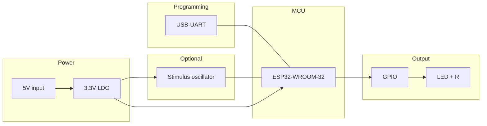

# Materializer-E33 build schematic

This document defines the build schematic (parts and connectivity). For exact quartz oscillator details see [QUARTZ_OSCILLATOR_SPEC.md](QUARTZ_OSCILLATOR_SPEC.md). A full PCB is out of scope here; optional KiCad schematic can live at `hardware/Materializer-E33.kicad_sch`.

---

## Block diagram



**ASCII equivalent:**

```
  5V ──► [LDO 3.3V] ──► 3.3V ──► ESP32-WROOM-32 (VCC)
                    └──────────► Optional: stimulus oscillator VCC

  USB ──► [USB-UART] ── TX/RX/EN/IO0 ──► ESP32

  ESP32 GPIO (e.g. GPIO2) ──► [R 330Ω] ──► LED anode ──► LED cathode ──► GND

  Optional: Oscillator OUT ──► ESP32 GPIO34 or GPIO35 (input)
```

---

## Parts list (minimal)

| Function | Part | Notes |
|----------|------|--------|
| **MCU** | ESP32-WROOM-32 or ESP32-WROOM-32E | 40 MHz crystal on-module; no external MCU crystal. |
| **Power** | AMS1117-3.3 or AP2112K-3.3 | 5 V → 3.3 V LDO. Decoupling: 100 nF + 10 µF per ESP-IDF guidelines. |
| **Programming** | CP2102 or CH340 | USB–UART: TX, RX, EN, IO0 to module. Or use ESP32-DevKitC and only add LED + optional oscillator. |
| **LED output** | GPIO → 330 Ω → LED | One or more GPIOs (e.g. GPIO2, GPIO4) → series 330 Ω (≈20 mA) → LED anode; cathode GND. For higher current: N-channel MOSFET (e.g. 2N7002) gate from GPIO, drain to LED strip, source to GND. |
| **External stimulus clock** | See [QUARTZ_OSCILLATOR_SPEC.md](QUARTZ_OSCILLATOR_SPEC.md) | Optional. Output → one GPIO input (e.g. GPIO34, GPIO35); 3.3 V only. |

---

## Pinout table

| Signal | GPIO / pin | Direction | Notes |
|--------|------------|-----------|--------|
| LED 1 | GPIO2 | Output | Default in firmware; 330 Ω to LED. |
| LED 2 (optional) | GPIO4 | Output | Optional second channel. |
| Stimulus clock (optional) | GPIO34 or GPIO35 | Input | Input-only; no internal pull-up. |
| UART TX (to ESP32 RX) | — | — | Connect USB-UART TX to module RX. |
| UART RX (to ESP32 TX) | — | — | Connect USB-UART RX to module TX. |
| EN | — | — | Boot: pull high for run; tie to UART DTR if used for auto-reset. |
| IO0 | — | — | Boot: pull low for download mode; tie to UART RTS if used. |
| 3.3 V | VCC | — | From LDO; also to oscillator VCC if used. |
| GND | GND | — | Common ground. |

---

## Schematic notes

- **Voltage:** All GPIOs and oscillator interface at 3.3 V. Do not drive GPIOs with 5 V without a level shifter.
- **External oscillator:** Only needed for the “stimulus clock” build variant (precise flicker timing independent of CPU). Omit for basic flicker using on-board 40 MHz + `esp_timer`.
- **Boot mode:** EN pull-up (e.g. 10 kΩ to 3.3 V); IO0 pull-down (e.g. 10 kΩ to GND). For download: hold IO0 low and reset (EN low then high).
